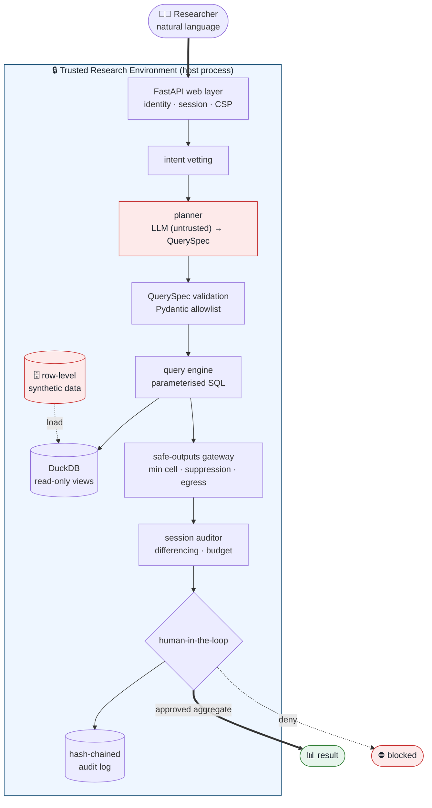
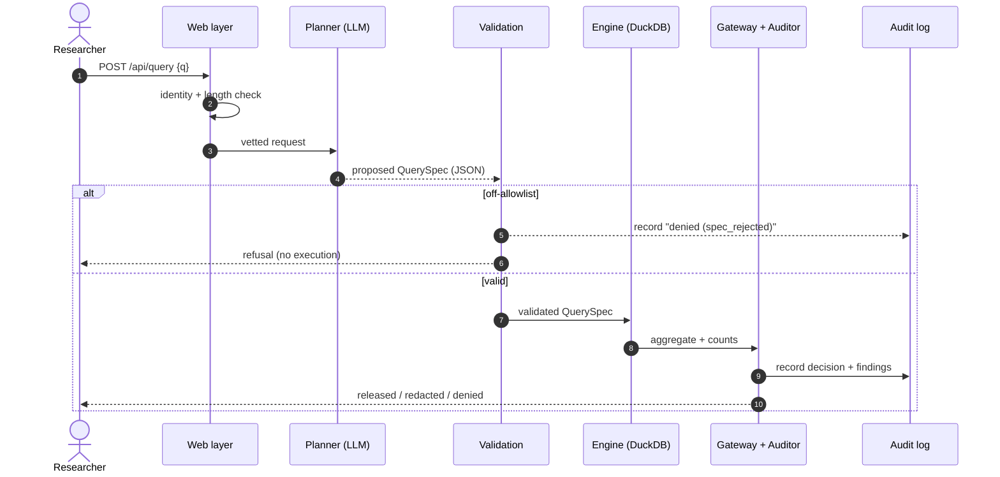
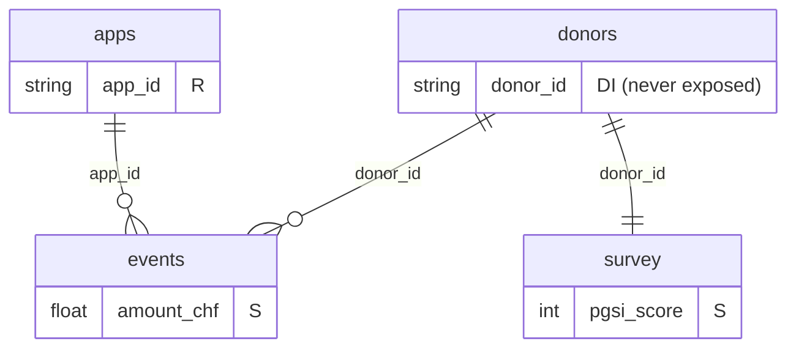

# Architecture

## Design principle

The large language model is **untrusted**. It can be wrong, or be prompt-injected
by the data it reads. So it is never given the ability to execute code or write
SQL. Its only output is a **proposal** — a `QuerySpec` — which the rest of the
system validates and executes deterministically. Every component after the model
is auditable and testable in isolation.

In the two-LLM deployment, the outside LLM uses a public tool manifest to plan,
and the safepod independently validates the proposed tool call. An optional
inside LLM may advise on statistical appropriateness or escalation, but it does
not authorize execution. See [Tool manifest](tool-manifest.md).

## Components

Red = untrusted (the model, the raw data). Everything else is deterministic and
covered by tests.

| Component | File | Responsibility |
|---|---|---|
| Web layer | `safetre_web/app.py` | routes, Pydantic request validation, security headers |
| Identity | `safetre_web/identity.py` | tailscale login → Safe People allowlist |
| Session | `safetre_web/session.py` | per-user `SessionAuditor` + history |
| Vetting | `safetre/analyst.py::vet_request` | block obviously hostile intent |
| Planner | `safetre/planner.py` | untrusted LLM → `QuerySpec` (+ `MockPlanner`) |
| Manifest | `safetre/manifest.py` | public capability contract for outside planners |
| QuerySpec | `safetre/query.py` | the validated allowlist boundary |
| Engine | `safetre/engine.py` | spec → parameterised DuckDB SQL |
| Gateway | `safetre/disclosure.py` | min cell size, suppression, egress checks |
| Auditor | `safetre/disclosure.py::SessionAuditor` | differencing, query budget |
| Audit log | `safetre/audit.py` | tamper-evident hash chain |

## Request lifecycle

## Data model

Four synthetic source tables; two read-only views are the only query surface.
Identifiers, free text and timestamps are **absent from the views by
construction**.

- **view `spend`** — `events ⨝ donors ⨝ apps`, exposing dimensions
  (`age_band, sex, canton, income_band, device_os, genre, contains_lootboxes,
  price_tier, event_type, age_rating`) and measures (`amount_chf,
  ingame_currency`).
- **view `wellbeing`** — `survey ⨝ donors`, exposing dimensions
  (`age_band, sex, canton, income_band, device_os, wave`) and measures
  (`pgsi_score, igds_score, wemwbs_score, monthly_spend_selfreport`).

See [`safetre/schema.py`](../safetre/schema.py) for column roles (DI / QI / S / R)
and [`safetre/query.py`](../safetre/query.py) for the catalogue the validator
enforces.

## Two execution paths

| Path | Trigger | Executor | Status |
|---|---|---|---|
| **Secure (default)** | web interface, in-catalogue queries | validated QuerySpec → DuckDB | Phase 1, shipped |
| **Escalation (legacy)** | analyses the DSL can't express | human-authored, reviewed code (`safetre/analyst.py` + `guards.py`) | manual; sandbox is illustrative only |

The secure path runs with no code execution at all. The legacy "LLM writes
pandas" path is retained for the red-team narrative and as the model for a
future human-reviewed escalation queue — it is **not** wired into the web
interface. See [Security model](security.md).
