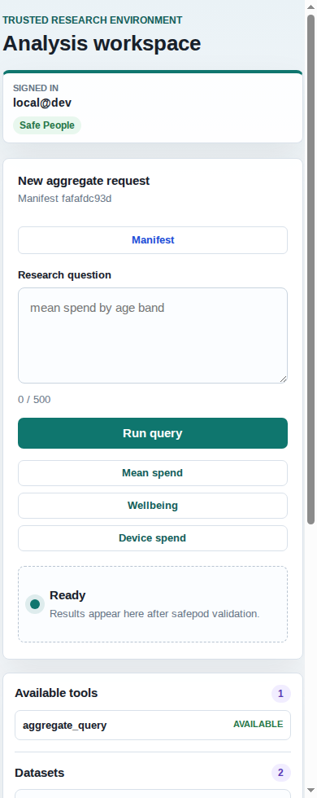

# Beginner guide

This page is for a new reader who wants to understand what this project is
before installing it.

## What problem does this solve?

Trusted Research Environments let approved researchers work with sensitive data
without taking raw rows away from the controlled setting. Traditionally, a human
analyst writes code, the TRE runs it near the data, and trained output checkers
decide whether aggregate results are safe to release.

`safe-tre-agent` asks what changes when an AI assistant is placed in that loop.
The assistant might be useful, but it is also untrusted: it can misunderstand a
request, be prompt-injected by data, or combine many safe-looking questions into
an unsafe disclosure.

The project therefore treats the model as a planner, not as an authority. The
model proposes a small JSON query. Deterministic code validates, executes, checks,
audits, and either releases, redacts, or denies the output.

## The short version

```text
researcher question
  -> untrusted planner proposes QuerySpec JSON
  -> strict validation checks the catalogue
  -> read-only DuckDB runs a fixed aggregate query
  -> disclosure gateway suppresses unsafe cells
  -> session auditor checks query history
  -> audit log records the decision
  -> only safe aggregate output leaves
```

The model never runs Python, writes SQL, reads files, opens sockets, or directly
sees raw rows in the secure web path.

## What you can run today

The current prototype runs on synthetic data shaped like linked app-spend,
loot-box, demographic, and wellbeing tables. It includes:

- a local web interface for aggregate questions;
- a deterministic mock planner for offline testing;
- an optional local OpenAI-compatible model adapter;
- disclosure controls for small cells, dominance, count rounding, and identifier
  egress;
- a session auditor for query budgets and differencing, including query-lineage
  tracking of released cohorts and complementary (secondary) suppression;
- a red-team script showing what leaks with the gateway off and what is blocked
  with the gateway on.


On narrow screens the same interface stacks the identity, query, and catalogue
panels:



## The three result states

| Status | Meaning |
|---|---|
| `released` | The query was valid and the output passed disclosure checks. |
| `redacted` | Some unsafe cells were suppressed, but the remaining table was safe. |
| `denied` | No data was returned. The request or the query sequence was unsafe. |

Denied requests are important. They are a safety feature, not a crash.

## What makes this different from a normal chatbot?

A normal chatbot has broad freedom to answer. This system deliberately narrows
what the model can do.

The public tool manifest tells the planner what aggregate tool exists, but it is
not authorization. The safepod still validates every proposed call independently.

The core security boundary is the `QuerySpec`:

- datasets are a closed list;
- dimensions and measures are allowlisted;
- filter values are bound parameters;
- direct identifiers, free text, raw timestamps, and high-granularity age fields
  are absent from the public catalogue;
- generated SQL is compiled into inspectable fixed-shape plans before execution.

## What is not production-ready yet?

This is still a research prototype. Before real data, the project needs at
least:

- ACRO/SACRO-grade output checking instead of the lightweight built-in gateway;
- cross-session differencing controls (the lineage auditor is per-session);
- a real human review workflow;
- off-pod audit anchoring and operational runbooks;
- site-specific safepod hardening, identity, and physical controls;
- a decision on whether differential privacy is needed for any release mode.

Start with [How to install](install.md), then follow the
[Test deployment runbook](test-deployment.md).
