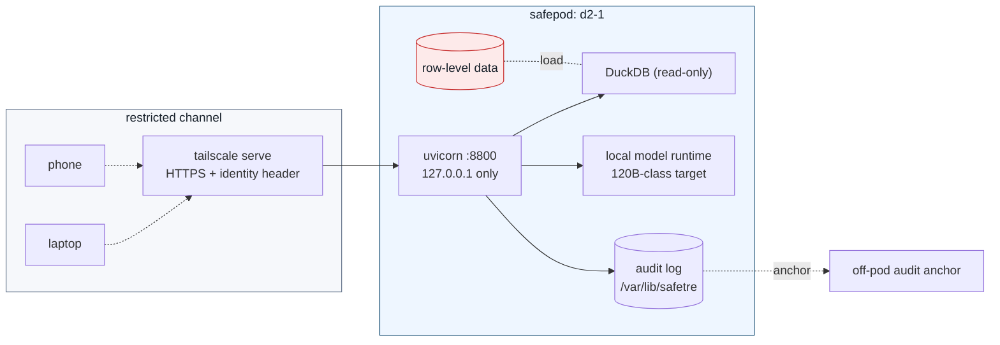

# Deployment

Target: a single host (e.g. `d2-1`) inside a **safepod**: data and server are
physically controlled, and researchers communicate only through a restricted
channel. There is no public internet path to the app. The host binds
`127.0.0.1`; `tailscale serve` provides TLS and the authenticated identity.

## Safepod topology



## Quick run (foreground)

```bash
uv sync --all-extras
uv run uvicorn safetre_web.app:app --host 127.0.0.1 --port 8800   # or: scripts/run_web.sh
```

Then expose to the tailnet:

```bash
tailscale serve --bg 8800
# -> https://d2-1.<tailnet>.ts.net   (TLS terminated by tailscale; identity header injected)
```

For real data, use the production settings below rather than the foreground
command.

## Production (systemd)

A hardened unit ships in `deploy/safetre-web.service`.

```bash
# in the repo on d2-1
uv sync --all-extras                 # creates .venv the unit points at

sudo cp deploy/safetre-web.service /etc/systemd/system/
sudo systemctl daemon-reload
sudo systemctl enable --now safetre-web
systemctl status safetre-web
systemd-analyze security safetre-web   # should report a low exposure score
```

The unit runs as a `DynamicUser` with `ProtectSystem=strict`, a private tmp,
restricted address families and syscalls, no capabilities, and writes only to its
`StateDirectory` (`/var/lib/safetre`). Adjust `WorkingDirectory`, the `.venv`
path and `--port` to your host.

The shipped unit also sets the app to require the restricted channel and a
tailnet identity. With `IPAddressDeny=any` plus localhost allows, the process
cannot accidentally talk to arbitrary network destinations. If your local model
runs on a different fixed address inside the safepod, add that address to the
systemd IP allowlist. Add it to `SAFETRE_CHANNEL_ALLOW_NETS` only if that same
host is also meant to call the web app as an approved ingress peer.

## Access control (Safe People)

1. **tailscale ACLs** decide which tailnet users/devices can reach the service —
   the auditable, policy-as-code outer gate.
2. **`SAFETRE_ALLOWLIST`** (comma-separated logins) is the app-level inner gate.
   When set, only those logins may run queries; everyone else gets `403`.

```bash
SAFETRE_ALLOWLIST="alex@example.org,sam@example.org" ...
```

3. **`SAFETRE_PROXY_SHARED_SECRET`** is **required** wherever
   `SAFETRE_REQUIRE_IDENTITY=1`. The proxy sends it as `X-Safetre-Proxy-Auth`;
   without it the identity header is not believed and every request is refused,
   so a production deployment configured without it answers nothing.

> **The loopback bind is not what makes the identity header trustworthy.** This
> page used to say that binding `127.0.0.1` meant only the local tailscale proxy
> could supply `Tailscale-User-Login`. Hardening #45 refuted it: `docs/security.md`
> puts the model runtime in the *untrusted* zone **on this host**, so loopback is a
> shared trust domain and not a boundary — any local process could present any
> login and have the audit log attribute queries to that person. Measured: 21
> forged requests accepted. The shared secret is what makes the header
> believable; the bind is what keeps the socket off the network.

## Restricted channel

The application checks the real peer address on every request before it runs
identity, planning, or query execution.

Recommended production defaults:

```bash
SAFETRE_RESTRICTED_CHANNEL=1
SAFETRE_CHANNEL_ALLOW_NETS=127.0.0.1/32,::1/128
SAFETRE_REQUIRE_IDENTITY=1
```

This matches the `tailscale serve -> localhost uvicorn` topology. If you place a
separate gateway in front of the safepod, add only that gateway's fixed address
or CIDR. Do not rely on `X-Forwarded-For`; the app ignores forwarded headers for
channel decisions.

## Configuration reference

All configuration is via environment variables.

| Variable | Default | Purpose |
|---|---|---|
| `SAFETRE_LLM` | `real` | `real` (model planner via the configured endpoint, the default) or `mock` (deterministic MockPlanner — explicit tests/CI opt-in, never a silent fallback); any other value is a startup error |
| `SAFETRE_LLM_BASE_URL` | `http://127.0.0.1:8000/v1` | OpenAI-compatible model endpoint; remote endpoints additionally need the synthetic-data-only opt-in |
| `SAFETRE_LLM_API_KEY` | `local` | bearer token for the local endpoint, if required |
| `SAFETRE_LLM_MODEL` | `local-120b` | runtime model id; default documents the 120B-class planning assumption |
| `SAFETRE_LLM_TEMPERATURE` | `0` | deterministic planning |
| `SAFETRE_LLM_TIMEOUT` | `60` | model request timeout in seconds |
| `SAFETRE_ALLOWED_LLM_HOSTS` | `localhost,127.0.0.1,::1` | comma-separated model endpoint hosts allowed without remote opt-in |
| `SAFETRE_ALLOW_REMOTE_LLM` | unset | set `1` only for synthetic-data remote endpoint experiments |
| `SAFETRE_ALLOWLIST` | – (open) | comma-separated Safe People logins |
| `SAFETRE_REQUIRE_IDENTITY` | unset | set `1` in production to deny requests without tailnet identity |
| `SAFETRE_RESTRICTED_CHANNEL` | `1` | reject requests outside the approved channel unless set to `0` |
| `SAFETRE_CHANNEL_ALLOW_NETS` | `127.0.0.1/32,::1/128` | comma-separated CIDRs allowed to reach the app |
| `SAFETRE_AUDIT_DB` | `audit.db` | path to the hash-chained audit log |
| `SAFETRE_AUDIT_KEY` | generated dev key | HMAC key; provide from an off-box secret in production |
| `PORT` | `8800` | used by `scripts/run_web.sh` |

Legacy `OPENAI_BASE_URL`, `OPENAI_API_KEY`, and `SAFETRE_MODEL` are still read
as fallbacks, but new deployments should use the `SAFETRE_LLM_*` names. The
model never sees secrets and never needs network beyond the local model
endpoint. See `.env.example` and [Model runtime](model-runtime.md).

## One process per audit database

**Do not run more than one worker.** No `--workers`, no `WEB_CONCURRENCY`, and
never two servers pointed at the same `SAFETRE_AUDIT_DB`. Three controls assume
a single process and all three fail silently without one (hardening #81):

- the **audit chain**. The head-read and the insert must be atomic, and the lock
  that makes them so is a `threading.Lock` inside one process. Two writers
  append from the same head: measured, 80 concurrent appends left every request
  answered normally, no error raised to any caller, and `verify()` **False**.
  Since #59 the next restart then refuses to boot on the unverifiable chain.
- the **session store**, which holds the query budget and the differencing
  lineage in memory. Two workers are two budgets, and a cohort recorded on one
  is invisible to the other — so the two halves of a differencing pair land on
  different workers and both release.
- the **rate limiter**, likewise per-process.

The application enforces this at startup with an advisory lock on
`$SAFETRE_AUDIT_DB.lock` and refuses to start if another process holds it
(`AuditDatabaseInUse`). The kernel releases the claim when the process exits, so
a crash needs no cleanup. If you need throughput, the answer is a bigger box or
the async delivery model on the roadmap, not more workers.

## Audit log operations

- The log is an append-only, hash-chained SQLite database at `SAFETRE_AUDIT_DB`.
- Verify integrity at any time: `GET /api/audit/verify` → `{"chain_intact": true,
  "head": "<64 hex>", "anchored": true|false}`, or in code
  `AuditLog(path).verify()`. Record the returned `head` off-box and set it as
  `SAFETRE_AUDIT_HEAD_ANCHOR`; that anchor is the only control that survives a
  compromise of this host.
- **Back it up with `sqlite3 audit.db ".backup out.db"`, or copy `audit.db*` —
  never `audit.db` alone.** The log runs in WAL mode; copying the database file
  on its own once produced an empty log that verified happily (#78). It is
  checkpointed after every append now, but the sidecars still matter: `.head` is
  the high-water mark `verify()` uses to detect truncation (#75).
- **Mirror it off-box** (rsync/litestream to a separate host) so a compromise of
  `d2-1` cannot rewrite history. (Phase 2.)
- Back up before upgrades; the chain is portable.

## Hardware and key custody

For real data, three hardware measures make the software controls real:

- **Audit key in hardware.** Hold `SAFETRE_AUDIT_KEY` in an HSM (FIPS 140-2/3,
  Common Criteria) or a hardware-backed key store — a YubiKey/PIV at small scale
  — and anchor the audit head off-pod so a host compromise cannot rewrite history
  undetected.
- **Phishing-resistant MFA.** Put FIDO2/YubiKey MFA at the identity provider in
  front of the restricted channel for all Safe People and admins; NIST recognises
  only smart cards and FIDO2 as phishing-resistant. Keep break-glass keys
  separate and logged.
- **Trusted host.** TPM plus secure/measured boot, with disk-encryption keys
  TPM-anchored and firmware locked, on top of the [safepod](safepod.md) physical
  controls.

See [Certification, hardware, and key custody](certification.md) for the full
guidance — the SATRE benchmark, the ISO 27001 / NHS DSPT / DEA stack, and a
pre-real-data checklist.

## Upgrades

```bash
git pull
uv sync --all-extras          # re-pins from uv.lock
sudo systemctl restart safetre-web
```

Run the test suite (`uv run pytest -q`) and `systemd-analyze security` after any
change that touches the request path or the unit file.

See [Safepod model](safepod.md) for the physical controls around the host:
locked enclosure, tamper evidence, disk encryption, port/radio disablement,
maintenance logging, and off-pod audit anchoring.
