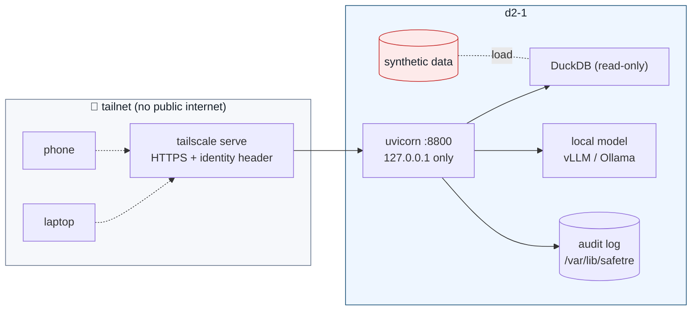

# Deployment

Target: a single host (e.g. `d2-1`) serving the interface to a **tailnet** only —
no public internet. The host binds `127.0.0.1`; `tailscale serve` provides TLS and
the authenticated identity.

## Topology



## Quick run (foreground)

```bash
uv sync --all-extras
uv run uvicorn safetre_web.app:app --host 127.0.0.1 --port 8800   # or: scripts/run_web.sh
```

Then expose to the tailnet:

```bash
tailscale serve --bg 8800
# -> https://d2-1.<tailnet>.ts.net   (TLS terminated by tailscale; identity header injected)
```

## Production (systemd)

A hardened unit ships in [`deploy/safetre-web.service`](../deploy/safetre-web.service).

```bash
# in the repo on d2-1
uv sync --all-extras                 # creates .venv the unit points at

sudo cp deploy/safetre-web.service /etc/systemd/system/
sudo systemctl daemon-reload
sudo systemctl enable --now safetre-web
systemctl status safetre-web
systemd-analyze security safetre-web   # should report a low exposure score
```

The unit runs as a `DynamicUser` with `ProtectSystem=strict`, a private tmp,
restricted address families and syscalls, no capabilities, and writes only to its
`StateDirectory` (`/var/lib/safetre`). Adjust `WorkingDirectory`, the `.venv`
path and `--port` to your host.

## Access control (Safe People)

1. **tailscale ACLs** decide which tailnet users/devices can reach the service —
   the auditable, policy-as-code outer gate.
2. **`SAFETRE_ALLOWLIST`** (comma-separated logins) is the app-level inner gate.
   When set, only those logins may run queries; everyone else gets `403`.

```bash
SAFETRE_ALLOWLIST="alex@example.org,sam@example.org" ...
```

Because the app binds `127.0.0.1`, the `Tailscale-User-Login` header can only be
supplied by the local tailscale proxy — a remote client cannot forge it.

## Configuration reference

All configuration is via environment variables.

| Variable | Default | Purpose |
|---|---|---|
| `SAFETRE_LLM` | `mock` | `mock` (deterministic MockPlanner) or `real` (LLMPlanner) |
| `OPENAI_BASE_URL` | `https://openrouter.ai/api/v1` | OpenAI-compatible endpoint (use a **local** URL in prod) |
| `OPENAI_API_KEY` | – | key for the endpoint (`local` for vLLM/Ollama) |
| `SAFETRE_MODEL` | `provider-d/model-mini` | model id (e.g. `provider-a/model-small`, `local-7b-instruct`) |
| `SAFETRE_ALLOWLIST` | – (open) | comma-separated Safe People logins |
| `SAFETRE_AUDIT_DB` | `audit.db` | path to the hash-chained audit log |
| `PORT` | `8800` | used by `scripts/run_web.sh` |

The model never sees secrets and never needs network beyond the local model
endpoint. See [`.env.example`](../.env.example).

## Audit log operations

- The log is an append-only, hash-chained SQLite database at `SAFETRE_AUDIT_DB`.
- Verify integrity at any time: `GET /api/audit/verify` → `{"chain_intact": true}`,
  or in code `AuditLog(path).verify()`.
- **Mirror it off-box** (rsync/litestream to a separate host) so a compromise of
  `d2-1` cannot rewrite history. (Phase 2.)
- Back up before upgrades; the chain is portable.

## Upgrades

```bash
git pull
uv sync --all-extras          # re-pins from uv.lock
sudo systemctl restart safetre-web
```

Run the test suite (`uv run pytest -q`) and `systemd-analyze security` after any
change that touches the request path or the unit file.
