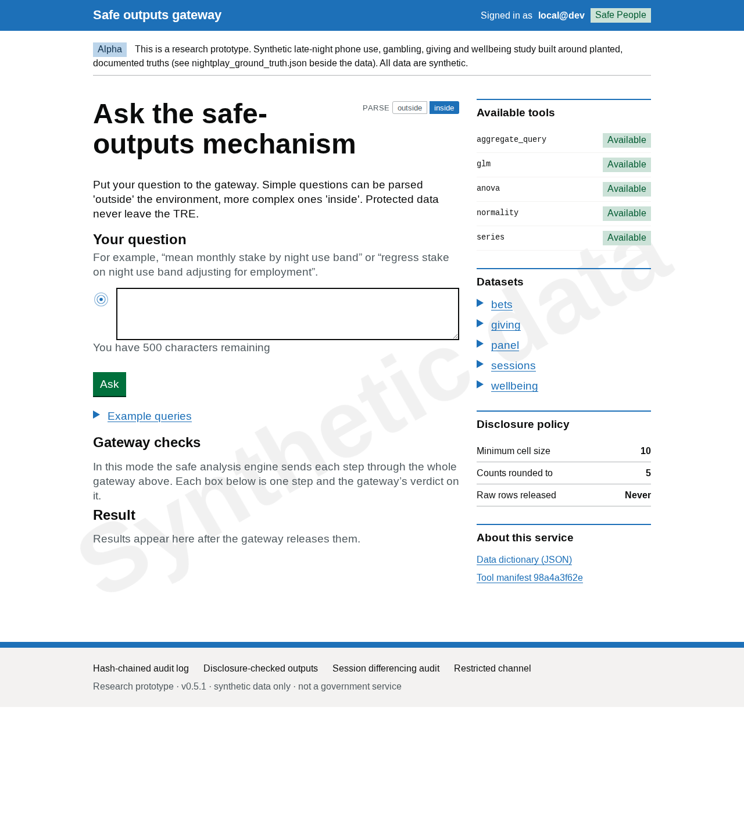
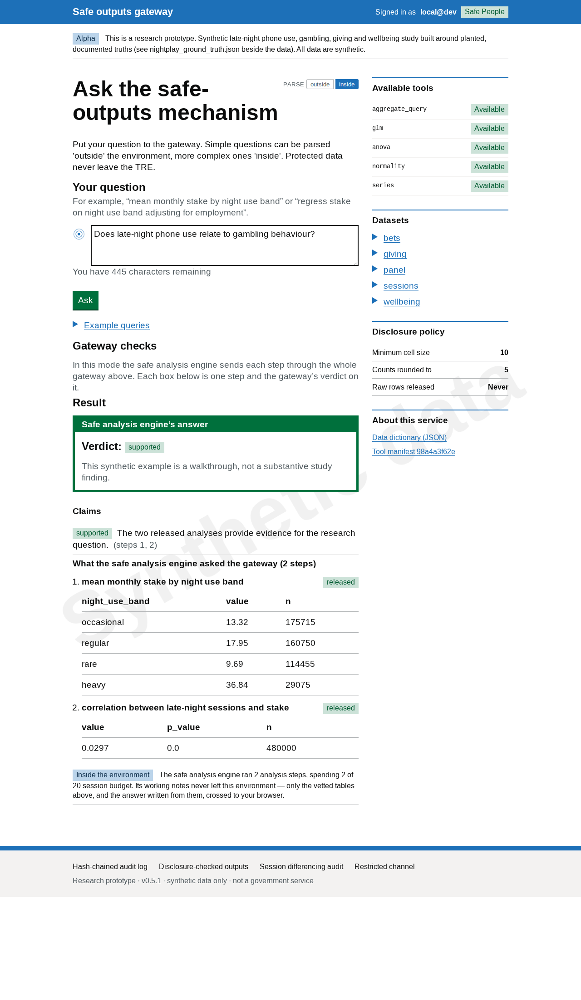
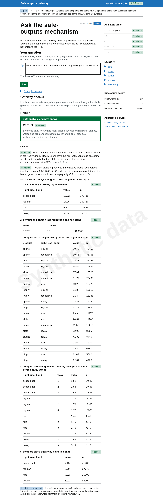
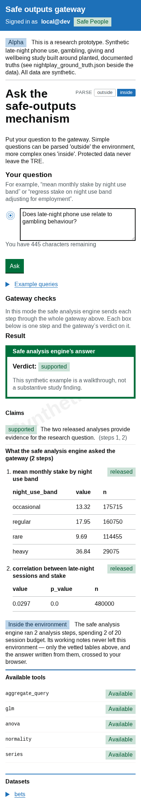
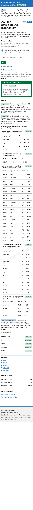

# Your first inside analysis

This walkthrough shows how to ask one research question that needs more than
one table. It uses a synthetic study of late-night phone use, gambling and
wellbeing. The example explains the workflow; it is not a finding about real
people.

## The question

We will ask:

> Does late-night phone use relate to gambling behaviour?

One average cannot answer this question. We want to know whether monthly stake
differs between people with different levels of late-night phone use, and
whether the number of late-night sessions relates to stake.

## Choose inside analysis

The small switch above the question box has two options. **Inside** is
selected by default; keep it when one question needs several linked analyses,
and switch to **outside** for a single calculation.



You write the question in ordinary language. You do not need to choose a test
or make a table first.

## Ask the whole question

Type the question and select **Ask**:

```text
Does late-night phone use relate to gambling behaviour?
```

The page shows each analysis step as it finishes. A step can be released,
partly withheld, or refused. One refused step does not end the analysis: the
system uses the other released evidence to give the most complete answer it can
support.

## Read the answer first

The top of the dossier gives a short verdict and a list of claims. Each claim
points to the numbered analysis steps it relies on. Read this as a brief results
section, then look at the tables behind it.



In this example the analysis makes two checks:

1. It compares monthly stake across the four late-night-use groups.
2. It tests the association between late-night sessions and stake.

The tables appear only after checks on group size and disclosure risk. They are
the evidence for the displayed conclusion.

## Look at the evidence, not the machinery

Each numbered section names the question the analysis asked and labels its
status. The useful record is the released tables and the question each table
answers, not the system's private working notes.

This gives you a simple way to discuss the result with a collaborator: start
with the claim, then ask whether the table beneath it supports the
interpretation.

## A broader question

The same approach can gather a larger body of evidence. This second synthetic
example asks:

> How does late-night phone use relate to gambling and wellbeing?

The engine answers it in five linked steps: the stake gradient, the
correlation with late-night sessions, product differences, problem-gambling
severity over three study waves, and sleep quality.



The engine's answer is written from the released tables, and each figure can
be checked against them. Stake rises steadily with late-night use, from 9.69 in
the rare group to 36.84 in the heavy group, although the correlation across
individual sessions is weak. The product breakdown is mixed. Problem-gambling
severity in the heavy group climbs across the three waves (2.37, 3.69, 5.14)
while the other groups stay flat, and the heavy group sleeps worst.

Not every question needs five analyses. The point is that one broad question
produces a readable record of the separate checks behind the answer, and each
table is still a separately checked release.

## It also works on a small screen

Both dossiers remain readable on a phone. Tables scroll horizontally when
needed; the claim and step labels stay visible.





## What to take away

Use **outside** analysis for a question with one clear calculation. Use
**inside** analysis when you want the system to gather several pieces of
released evidence before giving an answer. The system never sends its working
notes or individual records to your browser.

For the technical design, read [The inside analyst](inside-analyst.md).