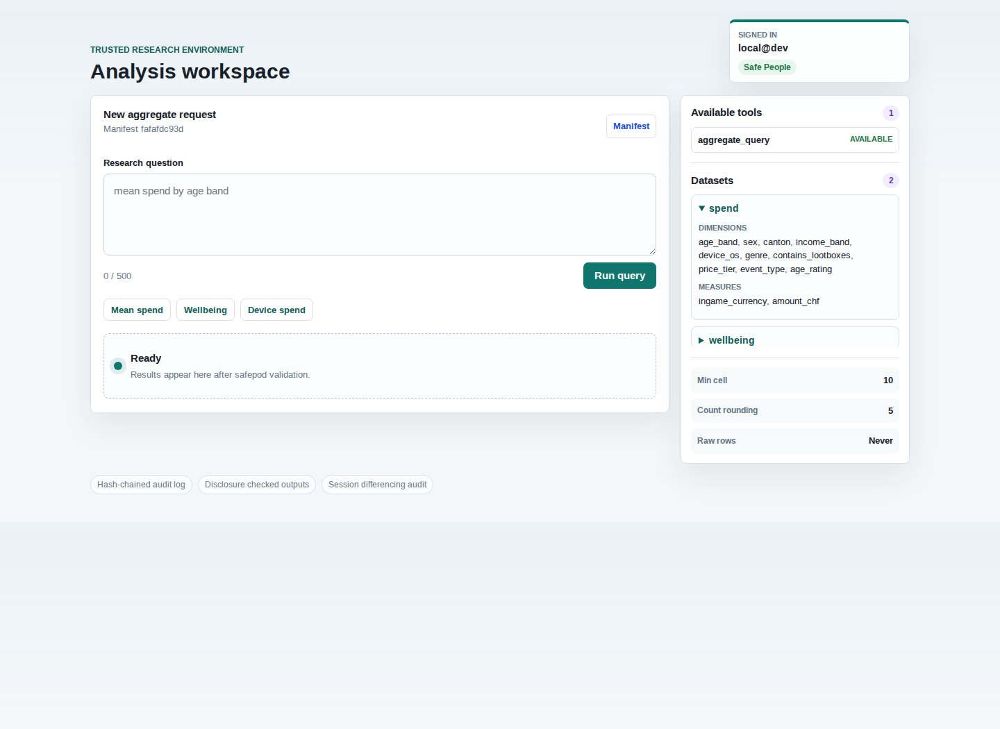

# safe-tre-agent documentation

A safe-outputs gateway that lets an **AI analyst** answer questions over
sensitive, SDDS-style data held in a **Trusted Research Environment (TRE)** —
without any row-level data leaving, and without trusting the model with code.

The model is treated as adversarial. Its only power is to propose a validated,
declarative query; a deterministic engine runs it; a disclosure gateway checks
every output; and every request is written to a tamper-evident audit log.

## Start here

| If you want to… | Read |
|---|---|
| Understand the project from scratch | [Beginner guide](beginner.md) |
| Install or run the project | [How to install](install.md) |
| Rehearse a synthetic-data deployment | [Test deployment runbook](test-deployment.md) |
| Use the interface as a researcher | [User guide](userguide.md) |
| Understand how the system is built | [Architecture](architecture.md) |
| Understand the threat model and controls | [Security model](security.md) |
| Understand the physical deployment boundary | [Safepod model](safepod.md) |
| Understand local model assumptions | [Model runtime](model-runtime.md) |
| Understand the two-LLM tool contract | [Tool manifest](tool-manifest.md) |
| See what's been red-teamed and fixed | [Hardening log](hardening-log.md) |
| Run it on a host / tailnet | [Deployment](deployment.md) |
| Work on the code | [Development](development.md) |
| Read the research rationale | [Write-up](writeup.md) |
| Position it for fellowship funding | [Fellowship positioning](fellowship.md) |

## The one-paragraph version

A researcher asks a question in natural language. An (untrusted) LLM turns it
into a **`QuerySpec`** — a JSON object describing an aggregate over an
allowlisted catalogue. Pydantic validates it; anything off-allowlist is rejected
before anything runs. A read-only **DuckDB** engine compiles the validated spec
into **parameterised** SQL over views that expose only non-identifying columns.
The result passes a **safe-outputs gateway** (minimum cell size, suppression,
egress checks), a **session auditor** (differencing, query budget), and a
**human-in-the-loop** policy, and the whole transaction is appended to a
**hash-chained audit log**. The web interface is served on `localhost` and
exposed to a tailnet via `tailscale serve`.

## Status

Phase 1 (secure web interface) is built and tested. The data is **synthetic**.
See [Security model § Limitations](security.md#limitations-and-roadmap) for what
is and isn't production-ready, and the [roadmap](security.md#limitations-and-roadmap).

> **Built on:** OpenSAFELY (Bennett Institute, Oxford) for the code-to-data,
> outputs-checked TRE model; ACRO/SACRO (DARE UK) for statistical disclosure
> control; the Five Safes framework for governance.

