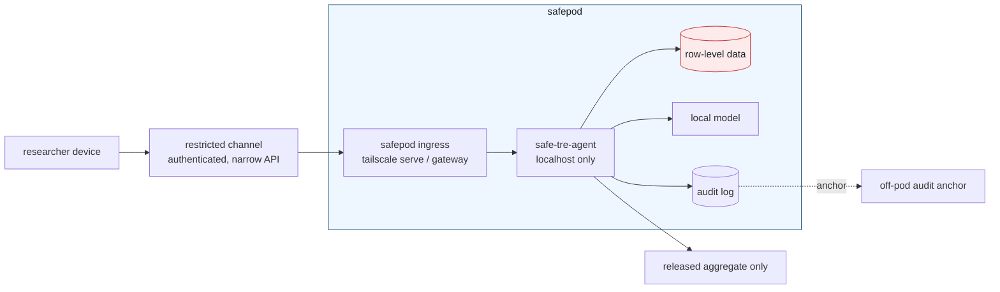

# Safepod model

The safepod is the physical and operational boundary around the sensitive data
and the server that can read it. The web application is only one control inside
that boundary. The intended deployment is:



## Security objective

Raw data never leaves the safepod. Researchers interact through a restricted
channel that can carry:

- authenticated research questions into the pod;
- validated aggregate outputs out of the pod;
- audit integrity signals out of the pod.

It must not carry arbitrary files, shell access, database ports, notebook
kernels, direct model prompts over row-level data, or unrestricted outbound
network traffic.

## Restricted channel

The restricted channel is a deliberately narrow bridge, not general network
access. In the current implementation it is:

- `tailscale serve` terminating authenticated HTTPS and injecting the
  `Tailscale-User-Login` identity;
- uvicorn bound to `127.0.0.1`, so only the local proxy can talk to the app;
- app-level channel enforcement in `safetre_web.channel`, which rejects requests
  whose real peer address is outside `SAFETRE_CHANNEL_ALLOW_NETS`;
- app-level Safe People allowlisting via `SAFETRE_ALLOWLIST`;
- JSON request validation, rate limiting, safe-output checks, and audit logging.

The app deliberately ignores `X-Forwarded-For` and similar headers for this
decision. Those headers are caller-controlled unless a trusted gateway strips
and rewrites them.

Recommended production defaults:

```bash
SAFETRE_RESTRICTED_CHANNEL=1
SAFETRE_CHANNEL_ALLOW_NETS=127.0.0.1/32,::1/128
SAFETRE_REQUIRE_IDENTITY=1
SAFETRE_ALLOWLIST=alex@example.org,sam@example.org
```

If the restricted channel gateway is not local to the app process, add only that
gateway's fixed address or CIDR to `SAFETRE_CHANNEL_ALLOW_NETS`. Do not add the
whole LAN unless the LAN itself is the controlled channel.

## Physical controls

For real data, the safepod should be treated like a small TRE appliance:

- locked enclosure, rack, room, or cabinet with tamper-evident seals;
- inventory record for chassis, disks, NICs, removable media, and boot media;
- full-disk encryption with keys not stored in plain text on the host;
- secure boot or measured boot where available, with firmware setup locked;
- exposed USB, Thunderbolt, Wi-Fi, Bluetooth, serial console, and unused NICs
  disabled or physically blocked;
- no public internet path from the pod; outbound traffic denied except the local
  model endpoint, the restricted channel, and approved audit anchoring;
- administrative access separated from researcher access, with break-glass use
  logged and reviewed;
- two-person rule for maintenance that can expose disks, console, firmware, or
  raw-data paths;
- off-pod backup or anchoring of audit heads so physical compromise cannot erase
  all evidence.

The physical controls do not replace software controls. They make the software
assumptions true: the only normal way in or out is the restricted channel.

## Failure modes

Important cases to test or rehearse:

| Failure | Expected outcome |
|---|---|
| uvicorn accidentally binds `0.0.0.0` | app middleware still rejects peers outside the channel |
| caller spoofs `X-Forwarded-For: 127.0.0.1` | ignored; real peer address is used |
| tailscale identity header missing | production mode denies query access |
| safepod is stolen while powered off | disk encryption protects data at rest |
| safepod is opened or serviced | tamper evidence and maintenance log trigger review |
| audit database is deleted or rewritten | off-pod anchor/mirror detects the missing or forged history |
| local model is replaced or reconfigured | measured boot, file integrity, and change control detect drift |

## Current state

The repository now enforces the restricted-channel assumption at the app layer
and documents the physical deployment model. A production safepod still needs
site-specific operational work: hardware selection, disk encryption, firmware
policy, physical access logging, off-pod audit anchoring, and network firewall
rules outside the Python process.
