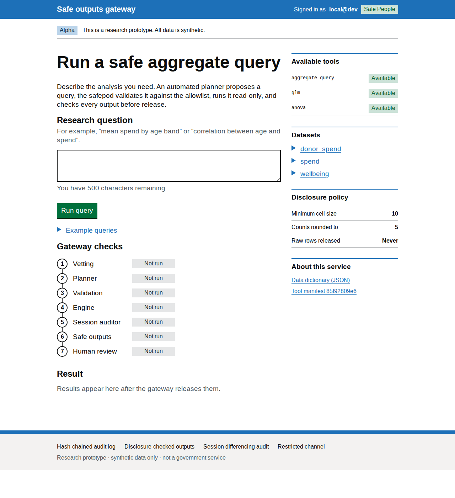
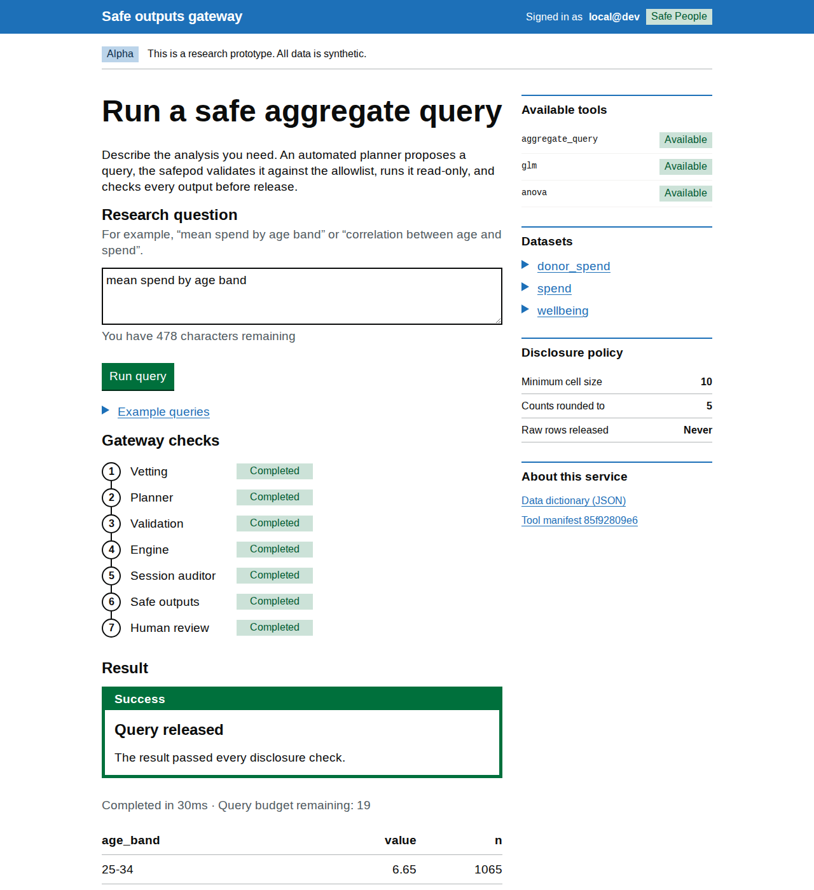
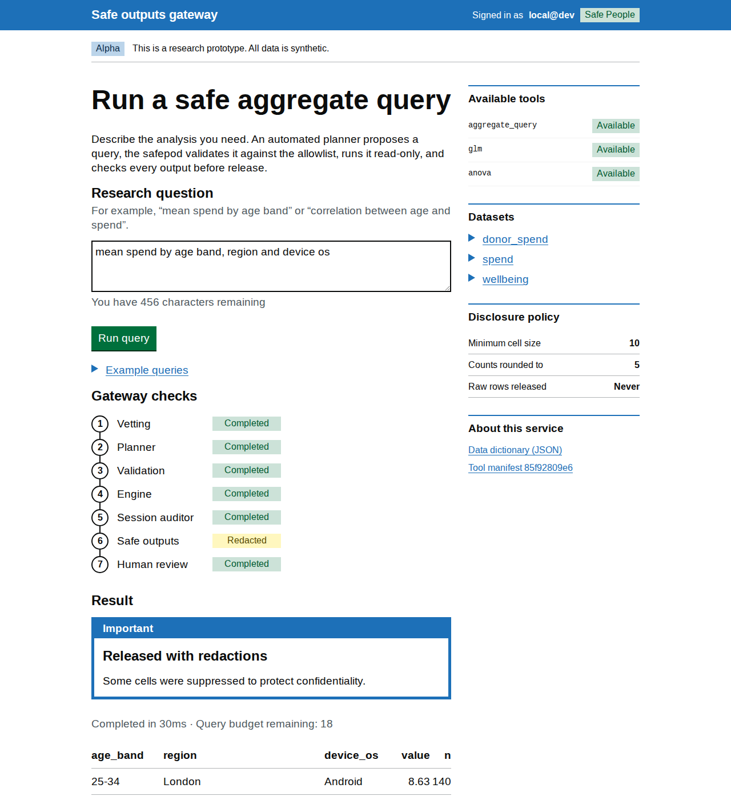
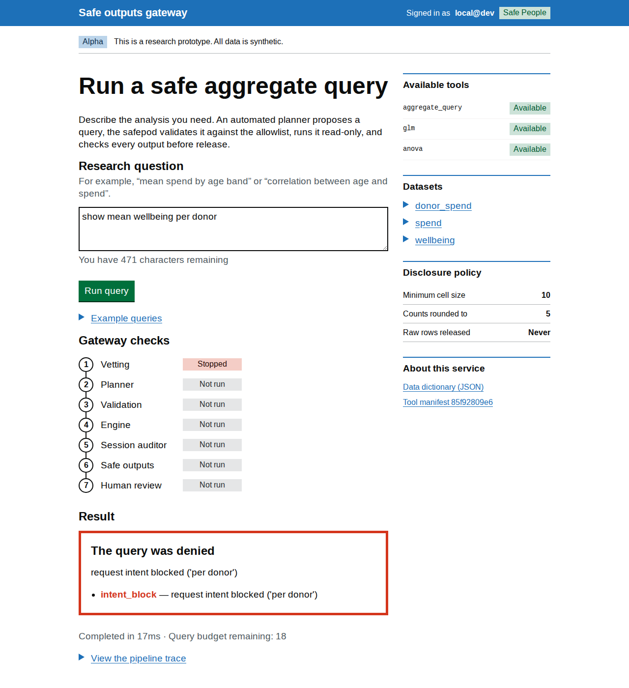

# Screenshot tour

Five states carry the safety argument: the home page, a released aggregate, a
redacted release, a denied request, and the audit verification. Each screenshot
below was captured from the app running locally on synthetic data with the
deterministic `mock` planner mode, so anyone can reproduce the set exactly —
see [reproducing the captures](#reproducing-the-captures).

## 1. Home — the rules are published up front



Before any query runs, the interface declares its own constraints: the
executable tools, the queryable datasets, and the disclosure policy — minimum
cell size 10, counts rounded to 5, raw rows released **never**. The banner
states that all data is synthetic, and the sidebar links the data dictionary
and the hashed tool manifest, so what the planner may propose is public and
versioned.

## 2. Released — a legitimate aggregate flows through

Query: `mean spend by age band`



All seven gateway checks — vetting, planner, validation, engine, session
auditor, safe outputs, human review — read *Completed*, and the released table
carries an `n` column per cell. The point to take away: a release is not just
numbers, it is numbers plus the recorded path they took through the controls.

## 3. Redacted — suppression is cell-level, not all-or-nothing

Query: `mean spend by age band, region and device os`



The three-way breakdown creates cells below the minimum size, so the *Safe
outputs* step reads *Redacted* and the banner says some cells were suppressed
to protect confidentiality — while the remaining aggregate is still released.
This shows the gateway acting as a scalpel rather than a switch, and the UI
naming exactly which stage intervened.

## 4. Denied — refused before the planner ever sees it

Query: `show mean wellbeing per donor`



A per-individual request stops at step 1: *Vetting* reads *Stopped*, every
later stage reads *Not run*, and the result is a denial with its reason
(`intent_block — request intent blocked ('per donor')`) and **no table**. Two
properties matter here: denials always carry a reason and never carry data,
and the request still lands in the audit log — a denied probe leaves a trace.

## 5. Audit verify — the whole session is tamper-evident

This state is an API response, so it is shown as a transcript rather than a
screenshot:

```console
$ curl http://127.0.0.1:8800/api/audit/verify
{"chain_intact": true}
```

Every request above — including the denied one — is now a link in a
hash-chained audit log. Editing or deleting any entry breaks the chain and
this endpoint returns `false`. The verification is simulatable: an auditor can
re-run it from the log alone, without trusting the server that produced it.

## Reproducing the captures

The images in this page are generated, not hand-curated:

```bash
uv run python scripts/make_data.py                 # once, if data/ is absent
uv run python scripts/make_demo_screenshots.py
```

The script starts a throwaway server on `127.0.0.1:8801` with `SAFETRE_LLM=mock`
(the deterministic tests/CI planner, chosen so captures need no model endpoint)
and a fresh temporary audit log, screenshots each state with headless Chrome,
and writes `docs/figures/demo-{home,released,redacted,denied}.png`. A running
demo server on port 8800 is left untouched.

To capture by hand instead, open these URLs — the fragment pre-fills and
submits the query on load — and screenshot at 1280px width:

| State | URL |
|---|---|
| home | `http://127.0.0.1:8801/` |
| released | `http://127.0.0.1:8801/#q=mean%20spend%20by%20age%20band` |
| redacted | `http://127.0.0.1:8801/#q=mean%20spend%20by%20age%20band,%20region%20and%20device%20os` |
| denied | `http://127.0.0.1:8801/#q=show%20mean%20wellbeing%20per%20donor` |

The same four states are what CI's accessibility job checks (WCAG 2.2 AA via
pa11y), so the tour and the accessibility evidence stay on the same footing.
