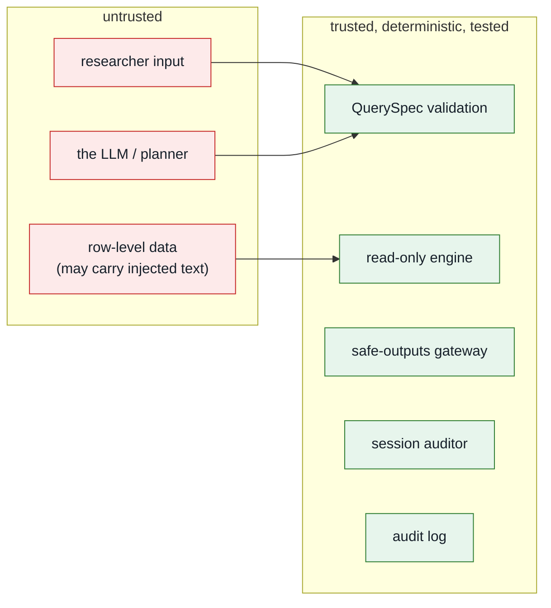

# Security model

This document is the reference for *why* the system is built the way it is. The
guiding rule: **assume the model is adversarial, and make every other component
deterministic, least-privilege and auditable.**

## Trust boundaries



The single most important property: **the untrusted model cannot reach the data
or the host except through a validated QuerySpec.** It cannot run code, write
SQL, open files, or make network calls.

## Physical boundary: the safepod

For real data, the server and row-level data sit inside a **safepod**: a locked,
tamper-evident physical and operational boundary. Researchers do not get general
network access to the host. They use a **restricted channel** that carries only
authenticated requests in and checked aggregate outputs out.

In the current deployment model that channel is `tailscale serve` into a
localhost-only web app. The app now enforces the assumption in code: requests
whose real peer address is outside `SAFETRE_CHANNEL_ALLOW_NETS` are rejected
before identity, planning, or query execution. Forwarded headers are ignored for
this decision.

See [Safepod model](safepod.md) for the physical controls and failure modes.

## Threats and controls

| # | Threat | Vector | Control | Where |
|---|---|---|---|---|
| 1 | Arbitrary code / RCE | model writes hostile code | model writes **no code**; only a QuerySpec | `query.py` |
| 2 | SQL injection | crafted filter value | values are **bound parameters**; identifiers allowlisted + regex-checked | `engine.py` |
| 3 | Identifier / free-text egress | query selects `donor_id` / `free_text` | not in any view, not in the catalogue, and re-checked at the gateway | `engine.py`, `disclosure.py` |
| 4 | Small-cell / dominance disclosure | over-granular grouping; one donor dominating a cell | minimum cell size (10); **p%-dominance** suppression; counts rounded to 5 | `disclosure.py`, `engine.py` |
| 5 | Differencing / triangulation | many "safe" queries combined | per-session auditor flags near-equal totals; query budget *(shallow — see roadmap)* | `disclosure.py` |
| 6 | Prompt injection via data | planted `free_text` tells model to exfiltrate | model can only emit a QuerySpec; `free_text` is unqueryable | `query.py` |
| 7 | Hostile intent | "give me row-level records…" | intent vetting rejects pre-planning *(defence in depth only — the allowlist is the real boundary)* | `analyst.py` |
| 8 | Header spoofing (identity) | forge `Tailscale-User-Login` | binds `127.0.0.1`; only canonical header trusted (`X-` dropped); `SAFETRE_REQUIRE_IDENTITY` fails closed | `identity.py`, deployment |
| 9 | Tamper with the record | edit/delete/**recompute** audit rows | **HMAC-keyed** chain (off-box key); `verify(expected_head)` checks an off-box anchor | `audit.py` |
| 10 | XSS in the UI | hostile content rendered | strict CSP (`script-src 'self'`), Jinja autoescape, pandas `escape=True` | `app.py`, templates |
| 11 | DoS / LLM cost amplification | request flood; huge `in` list; pathological group-by | per-user rate limit (429); `in`≤50, group-by≤3; DuckDB memory/thread + row caps | `rate.py`, `query.py`, `engine.py` |
| 12 | Bypass the safepod channel | accidental public bind, direct LAN access, spoofed proxy headers | restricted-channel middleware checks real peer address; uvicorn binds localhost; systemd/network firewall deny non-channel traffic | `safetre_web/channel.py`, deployment |

The red-team (`redteam/run_redteam.py`) and the test suite exercise these
directly (see `tests/test_secure.py`, `test_invariants.py`, `test_disclosure.py`).
A running record of findings and fixes is in the
[hardening log](hardening-log.md).

## Why a QuerySpec instead of a sandbox

Executing model-written code — even sandboxed — is an RCE surface, and a denylist
of "bad" code patterns is bypassable. Replacing it with a **validated,
declarative query** has three security benefits:

1. **The attack surface is bounded by construction.** The set of expressible
   queries is finite and enumerable; you can reason about all of them.
2. **No injection.** Identifiers come only from the allowlist; values are bound
   parameters.
3. **It is testable.** Validation is a pure function with exhaustive unit tests.

The trade-off — some bespoke analyses can't be expressed — is resolved the way
OpenSAFELY does it: such work goes through a **human-authored, reviewed**
escalation path, not the live agent.

## Defence in depth (the same fact checked twice)

Identifiers and free text are blocked in **three** independent places: they are
absent from the catalogue (validation rejects them), absent from the DuckDB
views (the engine cannot select them), and re-checked by the gateway's
`leak_detector` before release. A bug in any one layer does not leak data.

## Deployment hardening

The application is one layer; the deployment is another. See
[Deployment](deployment.md) for specifics. Summary:

- **Network:** binds `127.0.0.1`; exposed only via `tailscale serve`. The tailnet
  (WireGuard) is the perimeter; tailscale ACLs scope which users reach the
  service; an app-level allowlist (`SAFETRE_ALLOWLIST`) is the Safe People gate.
  The app also rejects requests outside `SAFETRE_CHANNEL_ALLOW_NETS`, so the
  restricted-channel assumption is checked at runtime.
- **Physical safepod:** the data host belongs in a locked, tamper-evident room,
  rack, cabinet, or appliance enclosure. Disable unused physical ports and
  radios, use disk encryption and firmware controls, log maintenance, and mirror
  or anchor the audit chain outside the pod.
- **Process:** `deploy/safetre-web.service` runs under systemd with
  `DynamicUser`, `ProtectSystem=strict`, `PrivateTmp`, `RestrictAddressFamilies`,
  `SystemCallFilter=@system-service`, an empty `CapabilityBoundingSet`, and
  `MemoryDenyWriteExecute`. Run `systemd-analyze security safetre-web` to audit.
- **Model:** in production, a **local** model (vLLM/Ollama on the same host).
  A remote API would itself be a data-egress channel.
- **Secrets:** none in the repo; provided via systemd `LoadCredential=` / env with
  `0077` umask; never inherited by anything that touches data.

## Supply chain

Dependencies are pinned and hashed in `uv.lock`. `bandit` (SAST) and `pip-audit`
(dependency CVEs) run in CI (`.github/workflows/ci.yml`) on every PR, alongside
the test suite and the boundary invariants (`tests/test_invariants.py`):

```bash
uv run bandit -r safetre safetre_web
uv run pip-audit
```

CI uses the `pull_request` trigger (fork PRs get no secrets), `permissions:
contents: read`, and actions pinned by commit SHA. CODEOWNERS gates the four
boundary files.

## Limitations and roadmap

This is **Phase 1 on synthetic data**. It is honest about what it is not. After
the [first hardening round](hardening-log.md), what remains:

- **Differencing control is shallow.** The session auditor tracks count totals,
  not query *lineage* or the measure values — differencing on sums across
  overlapping cohorts can still evade it. Needs lineage tracking and, ultimately,
  a **differential-privacy accountant**.
- **Only primary suppression.** A suppressed small/dominated cell can sometimes
  be reconstructed from released margins; needs **complementary suppression**.
- The disclosure engine is an ACRO-*inspired* stand-in (it now does threshold +
  dominance + rounding); production should wrap **ACRO** proper.
- The audit log is HMAC-keyed but should be **mirrored off-box** and its key held
  off-box for full tamper-resistance.
- Remote-LLM mode (`SAFETRE_LLM=real` to a non-local endpoint) egresses the
  *research questions* and is an SSRF target; production must pin the endpoint to
  a **local** model.
- Safepod physical controls are operational, not fully testable in this repo:
  disk encryption, tamper evidence, port blocking, audit anchoring, and
  maintenance process must be implemented per site.
- The legacy code-execution path (`guards.py`) is **illustration, not a secure
  jail**; it is not exposed by the web interface and would need real container
  isolation (gVisor / Firecracker) before any use.
- Human-in-the-loop is a policy stub; production pairs it with a reviewer queue
  and an AI output-checker.

| Phase | Scope | State |
|---|---|---|
| 1 | secure web interface, QuerySpec engine, audit log | **done** |
| 2 | tailscale ACL + allowlist enforcement, off-box log mirroring | next |
| 3 | HITL reviewer queue for escalated analyses; live trace | planned |
| 4 | ACRO proper, DP accountant, container-isolated escalation | pre-real-data |

**No real data should touch this system before Phase 4.**
