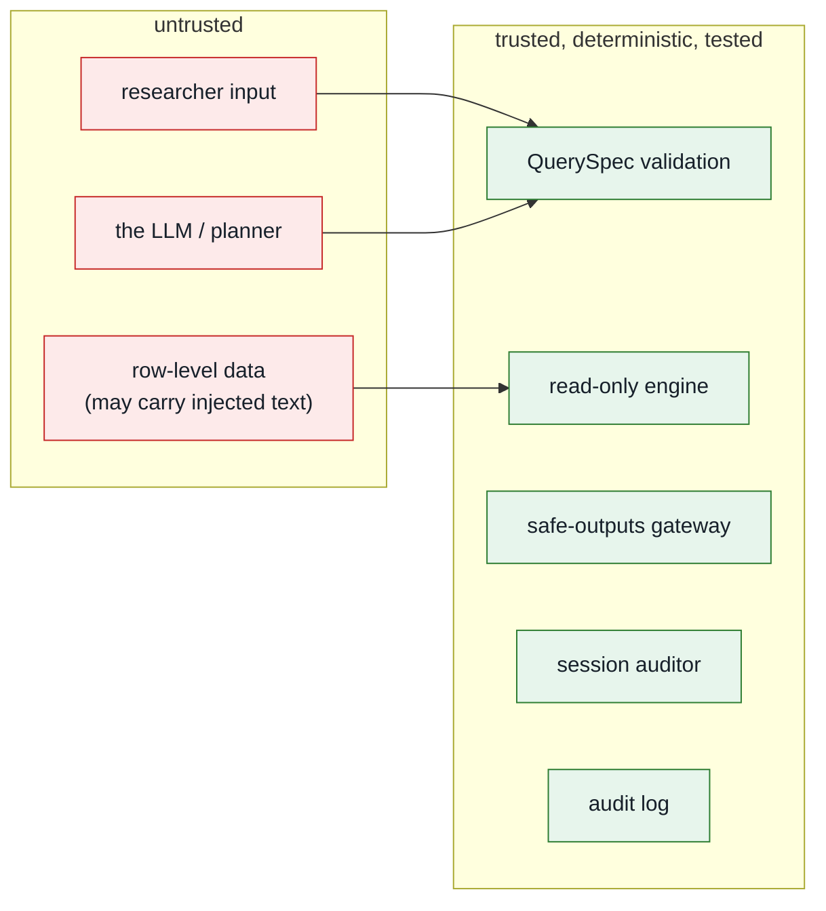

# Security model

This document is the reference for *why* the system is built the way it is. The
guiding rule: **assume the model is adversarial, and make every other component
deterministic, least-privilege and auditable.**

## Trust boundaries



The single most important property: **the untrusted model cannot reach the data
or the host except through a validated QuerySpec.** It cannot run code, write
SQL, open files, or make network calls.

## Threats and controls

| # | Threat | Vector | Control | Where |
|---|---|---|---|---|
| 1 | Arbitrary code / RCE | model writes hostile code | model writes **no code**; only a QuerySpec | `query.py` |
| 2 | SQL injection | crafted filter value | values are **bound parameters**; identifiers allowlisted + regex-checked | `engine.py` |
| 3 | Identifier / free-text egress | query selects `donor_id` / `free_text` | not in any view, not in the catalogue, and re-checked at the gateway | `engine.py`, `disclosure.py` |
| 4 | Small-cell disclosure | over-granular grouping | minimum cell size (10); offending cells suppressed | `disclosure.py` |
| 5 | Differencing / triangulation | many "safe" queries combined | per-session auditor flags near-equal totals; query budget | `disclosure.py` |
| 6 | Prompt injection via data | planted `free_text` tells model to exfiltrate | model can only emit a QuerySpec; `free_text` is unqueryable | `query.py` |
| 7 | Hostile intent | "give me row-level records…" | intent vetting rejects pre-planning | `analyst.py` |
| 8 | Header spoofing (identity) | forge `Tailscale-User-Login` | app binds `127.0.0.1`; only the local tailscale proxy can inject it | `app.py`, deployment |
| 9 | Tamper with the record | edit/delete audit rows | hash-chained log; `verify()` detects any break | `audit.py` |
| 10 | XSS in the UI | hostile content rendered | strict CSP (`script-src 'self'`), Jinja autoescape, pandas `escape=True` | `app.py`, templates |

The red-team (`redteam/run_redteam.py`) and the test suite exercise 1, 3–7 and 9
directly. See [Usage § What gets denied](usage.md#what-gets-denied-or-redacted).

## Why a QuerySpec instead of a sandbox

Executing model-written code — even sandboxed — is an RCE surface, and a denylist
of "bad" code patterns is bypassable. Replacing it with a **validated,
declarative query** has three security benefits:

1. **The attack surface is bounded by construction.** The set of expressible
   queries is finite and enumerable; you can reason about all of them.
2. **No injection.** Identifiers come only from the allowlist; values are bound
   parameters.
3. **It is testable.** Validation is a pure function with exhaustive unit tests.

The trade-off — some bespoke analyses can't be expressed — is resolved the way
OpenSAFELY does it: such work goes through a **human-authored, reviewed**
escalation path, not the live agent.

## Defence in depth (the same fact checked twice)

Identifiers and free text are blocked in **three** independent places: they are
absent from the catalogue (validation rejects them), absent from the DuckDB
views (the engine cannot select them), and re-checked by the gateway's
`leak_detector` before release. A bug in any one layer does not leak data.

## Deployment hardening

The application is one layer; the deployment is another. See
[Deployment](deployment.md) for specifics. Summary:

- **Network:** binds `127.0.0.1`; exposed only via `tailscale serve`. The tailnet
  (WireGuard) is the perimeter; tailscale ACLs scope which users reach the
  service; an app-level allowlist (`SAFETRE_ALLOWLIST`) is the Safe People gate.
- **Process:** `deploy/safetre-web.service` runs under systemd with
  `DynamicUser`, `ProtectSystem=strict`, `PrivateTmp`, `RestrictAddressFamilies`,
  `SystemCallFilter=@system-service`, an empty `CapabilityBoundingSet`, and
  `MemoryDenyWriteExecute`. Run `systemd-analyze security safetre-web` to audit.
- **Model:** in production, a **local** model (vLLM/Ollama on the same host).
  A remote API would itself be a data-egress channel.
- **Secrets:** none in the repo; provided via systemd `LoadCredential=` / env with
  `0077` umask; never inherited by anything that touches data.

## Supply chain

Dependencies are pinned and hashed in `uv.lock`. `bandit` (SAST) and `pip-audit`
(dependency CVEs) are dev dependencies and part of the intended CI gate:

```bash
uv run bandit -r safetre safetre_web
uv run pip-audit
```

## Limitations and roadmap

This is **Phase 1 on synthetic data**. It is honest about what it is not:

- The legacy code-execution path (`guards.py`) is **defence-in-depth
  illustration, not a secure jail**. It is not exposed by the web interface; if
  it is ever used it needs real container isolation (gVisor / Firecracker).
- The disclosure engine is a lightweight, ACRO-inspired stand-in. Production
  should wrap **ACRO** proper (p%-dominance, class disclosure).
- The query budget is a heuristic; it should become a formal **differential
  privacy** accountant.
- Human-in-the-loop is a policy stub; production pairs it with a reviewer queue
  and an AI output-checker.
- The audit log should be **mirrored off-box** so a host compromise cannot erase
  the trail.

| Phase | Scope | State |
|---|---|---|
| 1 | secure web interface, QuerySpec engine, audit log | **done** |
| 2 | tailscale ACL + allowlist enforcement, off-box log mirroring | next |
| 3 | HITL reviewer queue for escalated analyses; live trace | planned |
| 4 | ACRO proper, DP accountant, container-isolated escalation | pre-real-data |

**No real data should touch this system before Phase 4.**
