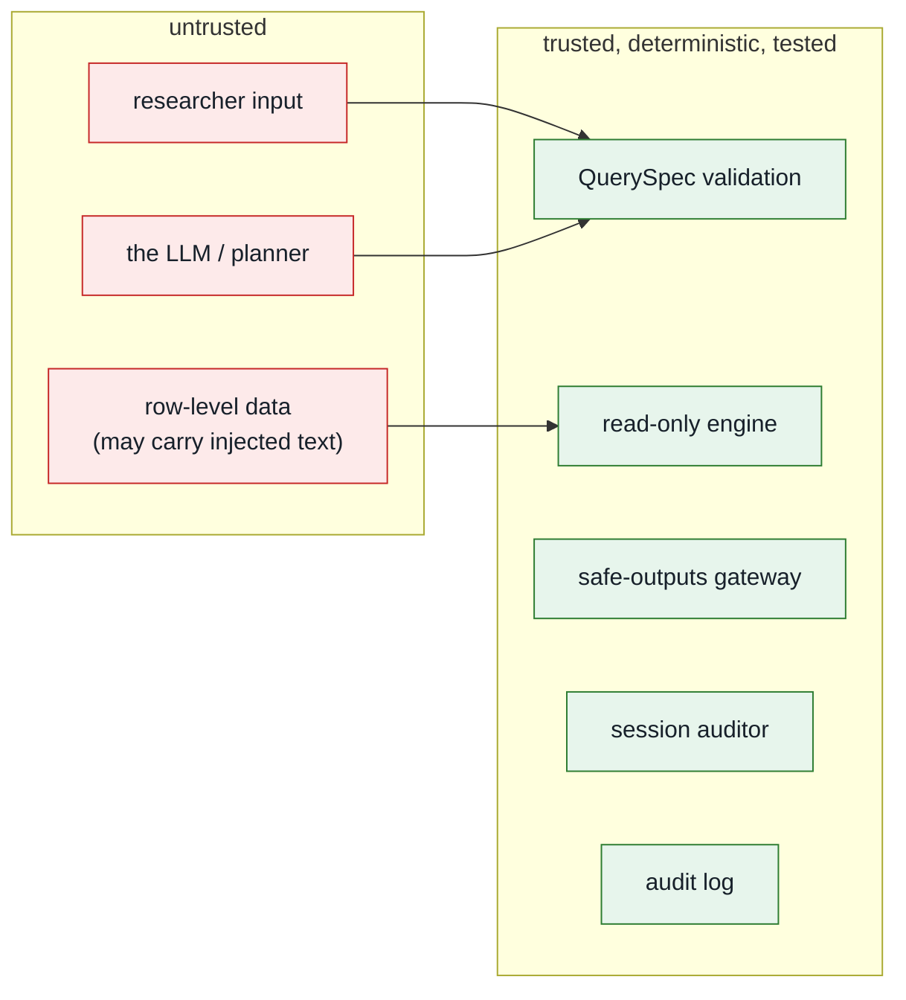

# Security model

This document is the reference for *why* the system is built the way it is. The
guiding rule: **assume the model is adversarial, and make every other component
deterministic, least-privilege and auditable.**

## Trust boundaries



The single most important property: **the untrusted model cannot reach the data
or the host except through a validated QuerySpec.** It cannot run code, write
SQL, open files, or make network calls.

## Model posture

Assume local models become good enough to plan well. The target capability is a
strong local model, roughly 120B-class, served inside the safepod on testing
hardware or an H100-class production accelerator profile. That assumption only
improves ergonomics: better `QuerySpec` proposals, fewer failed parses, and more
natural researcher interaction.

It does **not** change the trust model. The model remains adversarial for
security purposes. It receives only the request and catalogue prompt, proposes
JSON, and the validator decides what can run. The default real client is
local-first and rejects non-allowlisted model hosts unless
`SAFETRE_ALLOW_REMOTE_LLM=1` is explicitly set for synthetic-data development.

For a two-LLM deployment, the outside model receives a public tool manifest and
proposes tool calls from it. The safepod treats that proposal as untrusted input.
The manifest helps the outside model plan; it does not authorize execution. An
inside model may add advisory review findings for statistical appropriateness,
but deterministic schemas, policy checks, and disclosure controls decide.

## Physical boundary: the safepod

For real data, the server and row-level data sit inside a **safepod**: a locked,
tamper-evident physical and operational boundary. Researchers do not get general
network access to the host. They use a **restricted channel** that carries only
authenticated requests in and checked aggregate outputs out.

In the current deployment model that channel is `tailscale serve` into a
localhost-only web app. The app now enforces the assumption in code: requests
whose real peer address is outside `SAFETRE_CHANNEL_ALLOW_NETS` are rejected
before identity, planning, or query execution. Forwarded headers are ignored for
this decision.

See [Safepod model](safepod.md) for the physical controls and failure modes.

## Threats and controls

| # | Threat | Vector | Control | Where |
|---|---|---|---|---|
| 1 | Arbitrary code / RCE | model writes hostile code | model writes **no code**; only a QuerySpec | `query.py` |
| 2 | SQL injection | crafted filter value | values are **bound parameters**; identifiers allowlisted + regex-checked | `engine.py` |
| 3 | Identifier / free-text egress | query selects `donor_id` / `free_text` | not in public views/catalogue, and re-checked at the gateway | `engine.py`, `disclosure.py` |
| 4 | Small-cell / dominance disclosure | over-granular grouping; one donor dominating a cell or a correlation | minimum cell size (10); **p%-dominance** suppression (sum/mean); **leave-one-donor-out influence** suppression (corr); counts rounded to 5 | `disclosure.py`, `engine.py` |
| 5 | Differencing / triangulation | many "safe" queries combined | per-session auditor flags near-equal totals; query budget *(shallow — see roadmap)* | `disclosure.py` |
| 6 | Prompt injection via data | planted `free_text` tells model to exfiltrate | model can only emit a QuerySpec; `free_text` is unqueryable | `query.py` |
| 7 | Hostile intent | "give me row-level records…" | intent vetting rejects pre-planning *(defence in depth only — the allowlist is the real boundary)* | `analyst.py` |
| 8 | Header spoofing (identity) | forge `Tailscale-User-Login` | binds `127.0.0.1`; only canonical header trusted (`X-` dropped); `SAFETRE_REQUIRE_IDENTITY` fails closed; header trust is **gated on a loopback-only channel** — a widened channel needs an explicit `SAFETRE_TRUST_FORWARDED_IDENTITY` opt-in (else fail closed), with an optional proxy shared secret | `identity.py`, `channel.py` |
| 9 | Tamper with the record | edit/delete/**recompute** audit rows | **HMAC-keyed** chain (off-box key); `verify(expected_head)` checks an off-box anchor | `audit.py` |
| 10 | XSS in the UI | hostile content rendered | strict CSP (`script-src 'self'`), Jinja autoescape, pandas `escape=True` | `app.py`, templates |
| 11 | DoS / LLM cost amplification | request flood; huge `in` list; pathological group-by | per-user rate limit (429); `in`≤50, group-by≤3; DuckDB memory/thread + row caps | `rate.py`, `query.py`, `engine.py` |
| 12 | Bypass the safepod channel | accidental public bind, direct LAN access, spoofed proxy headers | restricted-channel middleware checks real peer address; uvicorn binds localhost; systemd/network firewall deny non-channel traffic | `safetre_web/channel.py`, deployment |
| 13 | LLM endpoint egress / SSRF | real planner configured to external or internal service URL | local-first default; allowlisted model endpoint hosts; remote endpoints require explicit synthetic-data opt-in | `safetre/llm.py` |
| 14 | Tool-manifest drift | outside planner proposes unavailable or outdated tools | manifest hash, deterministic safepod validation, planned tools are non-executable until implemented and reviewed | `safetre/manifest.py`, `query.py` |
| 15 | Concurrency bypass of session controls | fire the two halves of a differencing pair concurrently; race the budget | a **per-session lock** serialises one identity's requests across the whole `observe → apply → record_cohort` critical section; `SessionStore.get` is guarded; over-budget queries short-circuit | `safetre_web/session.py`, `app.py`, `service.py` |
| 16 | Policy config that does nothing | operator tightens `min_cell_size`, code ignores it | thresholds resolve through one loader (defaults < `config.yaml` < env) and flow into the gateway/auditor; a test asserts a changed threshold changes a real suppression | `safetre/config.py`, `disclosure.py` |
| 17 | Fail-open suppression | dominance/influence check returns NULL and the cell releases | unresolved safety columns fill to **+inf** (unsafe) and the detector treats NaN/inf as a violation — suppression fails **closed** | `engine.py`, `disclosure.py` |

Raw age is treated as an internal analysis variable, not a public column. Fixed
tools may use it inside the safepod, for example donor-level age/spend
correlation, but it cannot be grouped, selected, rendered, or returned.

## Side channels and residual oracles

A safe-outputs gateway cannot be side-channel-free, because *the release decision
itself* is information. We state the channels honestly rather than imply they are
closed:

- **The SDC response is the primary oracle, by design.** `released` / `redacted`
  / `denied`, and the finding text ("1 cell below threshold"), tell the analyst
  something about the underlying cells — this is inherent to any interactive
  disclosure control. It is bounded by secondary suppression (a margin with one
  suppressed cell suppresses another), the query-lineage auditor, and — the
  principled end state — a **DP accountant** that adds calibrated noise so the
  answer, not just the release/deny bit, is privacy-bounded. Refusal messages are
  deliberately **non-numeric**: the auditor never reports the exact total delta
  or symmetric-difference size (that count is the very thing a differencing
  attack seeks), only the boolean "too similar to a prior release".

- **Simulatable up to one bit.** The differencing decision is defined against
  donor **marginals**, and the disclosure-safe projection of those marginals is
  published at `GET /api/marginals` (sub-threshold cells shown as `null`,
  the rest rounded), so an analyst can reproduce the decision — except for the
  residual case where isolating a *sub-threshold* category is caught using the
  true count internally. That residual (one bit) is the documented deviation a
  DP accountant closes; see the roadmap.

- **Schema disclosure is design-time, not data-derived.** `GET /api/schema`
  publishes the study **codebook** — dimension and measure names, types,
  disclosure roles (QI/S/R), descriptions, and the *declared* categorical value
  domains. All of it is metadata about the study design, independent of any
  participant, so it is safe to show in full (a valid category being an *option*
  is not the same as anyone having it). The two things that *are* data-derived —
  which values actually occur, and how many donors carry them — stay behind
  `/api/marginals` with the SDC treatment above. Crucially, the published
  marginals now also drop any value **outside its declared domain**: an
  undeclared string (a hostile payload smuggled into a field, a data-entry
  typo) is disclosive by its very *name*, so count-nulling it is not enough — it
  is removed entirely, leaving only codebook categories.

- **Timing.** Denial *stage* is distinguishable by latency (intent-vetting vs
  validation vs a gateway suppression that runs the full engine first), but the
  analyst already learns the stage from the explicit status, so no extra signal.
  Data-dependent DuckDB latency is a theoretical channel (a larger group
  aggregates marginally slower) but is sub-millisecond on the synthetic scale and
  swamped by network/scheduling jitter over the tailnet; the same DP noise is the
  principled defence, and the engine already runs the same plan regardless of
  outcome (suppression is post-computation). MAC verification uses
  `hmac.compare_digest`; the identity/allowlist comparisons are against
  non-secret values, so their non-constant time leaks nothing.

- **Audit-lock contention (accepted, low).** Every request serialises briefly on
  the audit log's write lock. That serialisation is a *correctness requirement*
  for the HMAC chain (the head-read and insert must be atomic), so it is not
  removed. The residual is a weak "someone else is writing right now" timing
  signal and a shared-fate latency coupling; the held section is minimal
  (read head, MAC, insert, commit) and off-box mirroring is the operational
  mitigation. Trading chain integrity for timing-channel resistance here would be
  the wrong call.

- **Micro-architectural / cache timing.** Effectively out of scope for the secure
  path: the untrusted model runs **no attacker-controlled code** in-process (it
  only proposes a `QuerySpec`), and the one secret-vs-attacker-input comparison
  (the audit MAC) is constant-time. There is no cryptographic secret compared
  against attacker-chosen plaintext in a data-dependent branch to attack.

The red-team (`redteam/run_redteam.py`) and the test suite exercise these
directly (see `tests/test_secure.py`, `test_invariants.py`, `test_disclosure.py`).
A running record of findings and fixes is in the
[hardening log](hardening-log.md).

## Why a QuerySpec instead of a sandbox

Executing model-written code — even sandboxed — is an RCE surface, and a denylist
of "bad" code patterns is bypassable. Replacing it with a **validated,
declarative query** has three security benefits:

1. **The attack surface is bounded by construction.** The set of expressible
   queries is finite and enumerable; you can reason about all of them.
2. **No injection.** Identifiers come only from the allowlist; values are bound
   parameters.
3. **It is testable.** Validation is a pure function with exhaustive unit tests.

The trade-off — some bespoke analyses can't be expressed — is resolved the way
OpenSAFELY does it: such work goes through a **human-authored, reviewed**
escalation path, not the live agent.

## Defence in depth (the same fact checked twice)

Identifiers and free text are blocked in **four** independent places: explicit
requests for raw rows, identifiers, or free text are stopped by intent vetting;
those fields are absent from the catalogue (validation rejects them), absent
from the DuckDB views (the engine cannot select them), and re-checked by the
gateway's `leak_detector` before release. A bug in any one layer does not leak
data.

## Deployment hardening

The application is one layer; the deployment is another. See
[Deployment](deployment.md) for specifics. Summary:

- **Network:** binds `127.0.0.1`; exposed only via `tailscale serve`. The tailnet
  (WireGuard) is the perimeter; tailscale ACLs scope which users reach the
  service; an app-level allowlist (`SAFETRE_ALLOWLIST`) is the Safe People gate.
  The app also rejects requests outside `SAFETRE_CHANNEL_ALLOW_NETS`, so the
  restricted-channel assumption is checked at runtime.
- **Physical safepod:** the data host belongs in a locked, tamper-evident room,
  rack, cabinet, or appliance enclosure. Disable unused physical ports and
  radios, use disk encryption and firmware controls, log maintenance, and mirror
  or anchor the audit chain outside the pod.
- **Process:** `deploy/safetre-web.service` runs under systemd with
  `DynamicUser`, `ProtectSystem=strict`, `PrivateTmp`, `RestrictAddressFamilies`,
  `SystemCallFilter=@system-service`, an empty `CapabilityBoundingSet`, and
  `MemoryDenyWriteExecute`. Run `systemd-analyze security safetre-web` to audit.
- **Model:** in production, a **local** model runtime on loopback or a fixed
  safepod host. A remote API would itself be a data-egress channel. The default
  model client is protocol-based, not SDK-bound, and targets an OpenAI-compatible
  local HTTP endpoint.
- **Secrets:** none in the repo; provided via systemd `LoadCredential=` / env with
  `0077` umask; never inherited by anything that touches data.

## Supply chain

Dependencies are pinned and hashed in `uv.lock`. `bandit` (SAST) and `pip-audit`
(dependency CVEs) run in CI (`.github/workflows/ci.yml`) on every PR, alongside
the test suite and the boundary invariants (`tests/test_invariants.py`):

```bash
uv run bandit -r safetre safetre_web
uv run pip-audit
```

CI uses the `pull_request` trigger (fork PRs get no secrets), `permissions:
contents: read`, and actions pinned by commit SHA. CODEOWNERS gates the four
boundary files.

## Limitations and roadmap

This is **Phase 1 on synthetic data**. It is honest about what it is not. The
[best-practice review](best-practice-review.md) benchmarks these limits against
ACRO/SACRO, OpenSAFELY, OWASP, and the auditing/DP literature (deviations
D1–D7). After the [first hardening round](hardening-log.md), what remains:

- **Human review, not replacement.** On real data the automated gateway is a
  **pre-filter** that reduces output-checker load, not a substitute for the
  two-trained-checker standard used by OpenSAFELY and SACRO. Keep two-human
  review on any real release; the agent layer buys throughput, which is the
  documented bottleneck for scaling TREs.
- **The frequency threshold counts individuals, not rows.** Every result carries
  an internal distinct-donor count (`n_donors`), and the gateway suppresses any
  cell with fewer than the threshold's donors even if it has many rows — so an
  event-level cell dominated by one active donor cannot pass.
- **Differencing control is per-session and simulatable.** The auditor tracks
  query *lineage* — each released cohort (normalized filter predicate) is
  remembered — and denies a near-duplicate cohort. The deny/allow decision is
  computed from **published donor marginals**, not the live donor sets, so a
  refusal leaks nothing an analyst could not already compute (simulatable
  auditing). It catches isolating a globally-rare category by one predicate; it
  does **not** catch differencing confined to an otherwise-narrow cohort (helped
  by the per-cell donor threshold), nor defend across sessions or colluding
  users. Global accounting needs a **differential-privacy accountant**.
- **Secondary suppression is heuristic beyond one dimension.** A margin left
  with exactly one suppressed cell now triggers complementary suppression of
  the next-smallest cell (iterated to a fixpoint). This is exact for one
  group-by dimension and conservative (over-suppressing) for more; minimal
  multi-dimensional suppression patterns are an LP problem → **ACRO** proper.
- The disclosure engine is an ACRO-*inspired* stand-in (it now does threshold +
  dominance + rounding); production should wrap **ACRO** proper.
- The audit log is HMAC-keyed but should be **mirrored off-box** and its key held
  off-box for full tamper-resistance.
- Remote-LLM mode to a non-local endpoint still egresses the *research
  questions*. The code now requires `SAFETRE_ALLOW_REMOTE_LLM=1`, but that flag
  remains synthetic-data-only and must not be enabled for real safepod data.
- Safepod physical controls are operational, not fully testable in this repo:
  disk encryption, tamper evidence, port blocking, audit anchoring, and
  maintenance process must be implemented per site.
- The legacy code-execution path (`guards.py`) is **illustration, not a secure
  jail**; it is not exposed by the web interface and would need real container
  isolation (gVisor / Firecracker) before any use.
- Human-in-the-loop is a policy stub; production pairs it with a reviewer queue
  and an AI output-checker.

| Phase | Scope | State |
|---|---|---|
| 1 | secure web interface, QuerySpec engine, audit log | **done** |
| 2 | tailscale ACL + allowlist enforcement, off-box log mirroring | next |
| 3 | HITL (human-in-the-loop) reviewer queue for escalated analyses; live trace | planned |
| 4 | ACRO proper, DP accountant, container-isolated escalation | pre-real-data |

**No real data should touch this system before Phase 4.**
