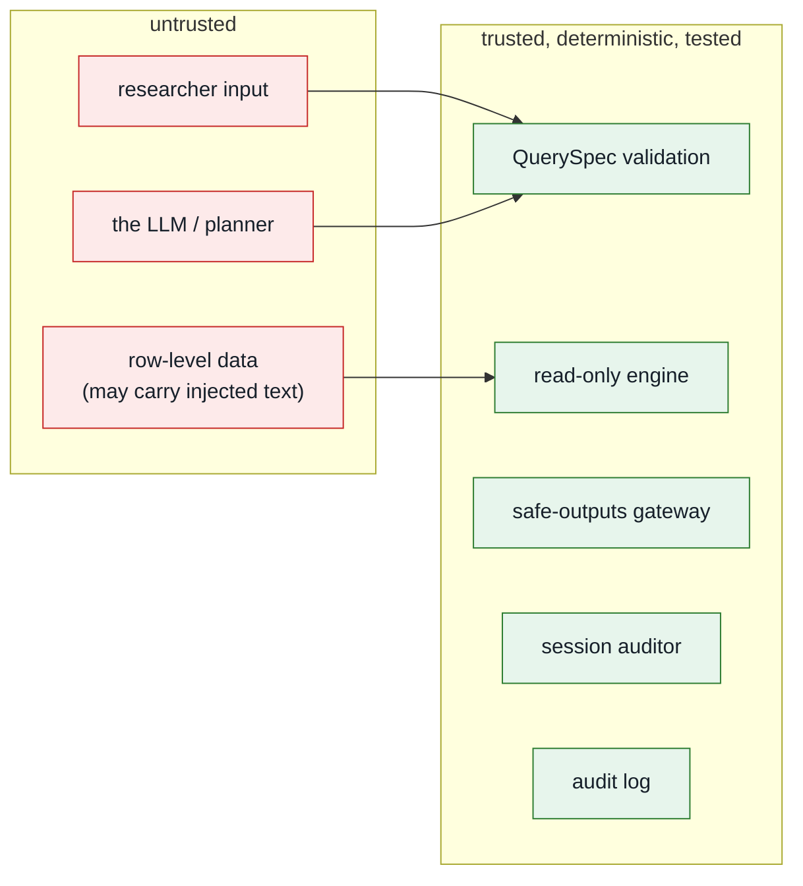

# Security model

This document is the reference for *why* the system is built the way it is. The
guiding rule: **assume the model is adversarial, and make every other component
deterministic, least-privilege and auditable.**

## Trust boundaries



The single most important property: **the untrusted model cannot reach the data
or the host except through a validated QuerySpec.** It cannot run code, write
SQL, open files, or make network calls.

## Model posture

Assume local models become good enough to plan well. The target capability is a
strong local model, roughly 120B-class, served inside the safepod on testing
hardware or an H100-class production accelerator profile. That assumption only
improves ergonomics: better `QuerySpec` proposals, fewer failed parses, and more
natural researcher interaction.

It does **not** change the trust model. The model remains adversarial for
security purposes. It receives only the request and catalogue prompt, proposes
JSON, and the validator decides what can run. The default real client is
local-first and rejects non-allowlisted model hosts unless
`SAFETRE_ALLOW_REMOTE_LLM=1` is explicitly set for synthetic-data development.

For a two-LLM deployment, the outside model receives a public tool manifest and
proposes tool calls from it. The safepod treats that proposal as untrusted input.
The manifest helps the outside model plan; it does not authorize execution. An
inside model may add advisory review findings for statistical appropriateness,
but deterministic schemas, policy checks, and disclosure controls decide.

## Physical boundary: the safepod

For real data, the server and row-level data sit inside a **safepod**: a locked,
tamper-evident physical and operational boundary. Researchers do not get general
network access to the host. They use a **restricted channel** that carries only
authenticated requests in and checked aggregate outputs out.

In the current deployment model that channel is `tailscale serve` into a
localhost-only web app. The app now enforces the assumption in code: requests
whose real peer address is outside `SAFETRE_CHANNEL_ALLOW_NETS` are rejected
before identity, planning, or query execution. Forwarded headers are ignored for
this decision.

See [Safepod model](safepod.md) for the physical controls and failure modes.

## Threats and controls

| # | Threat | Vector | Control | Where |
|---|---|---|---|---|
| 1 | Arbitrary code / RCE | model writes hostile code | model writes **no code**; only a QuerySpec | `query.py` |
| 2 | SQL injection | crafted filter value | values are **bound parameters**; identifiers allowlisted + regex-checked | `engine.py` |
| 3 | Identifier / free-text egress | query selects `donor_id` / `free_text` | not in public views/catalogue, and re-checked at the gateway | `engine.py`, `disclosure.py` |
| 4 | Small-cell / dominance disclosure | over-granular grouping; one donor dominating a cell or a correlation | minimum cell size (10); **p%-dominance** suppression (sum/mean); **leave-one-donor-out influence** suppression (corr); counts rounded to 5 | `disclosure.py`, `engine.py` |
| 5 | Differencing / triangulation | many "safe" queries combined | per-session auditor flags near-equal **distinct-donor** totals; lineage tests the **row-level** difference of two releases, not just their donor cohorts (a filter on an app/event attribute leaves the cohorts identical while the released values differ by a suppressed cell); published marginals remain the cheap first test; internal range filters restricted to public band edges; query budget *(shallow — see roadmap)* | `disclosure.py`, `engine.py`, `query.py` |
| 6 | Prompt injection via data | planted `free_text` tells model to exfiltrate | model can only emit a QuerySpec; `free_text` is unqueryable | `query.py` |
| 7 | Hostile intent | "give me row-level records…" | intent vetting rejects pre-planning *(defence in depth only — the allowlist is the real boundary)* | `analyst.py` |
| 8 | Header spoofing (identity) | forge `Tailscale-User-Login` from any local process — including the untrusted model runtime, which shares loopback | binds `127.0.0.1`; only canonical header trusted (`X-` dropped); a repeated or comma-joined header is **refused, not resolved**; `SAFETRE_PROXY_SHARED_SECRET` is **required** wherever `SAFETRE_REQUIRE_IDENTITY=1`, because loopback is a shared trust domain and not a boundary; an empty allowlist admits nobody in production; a widened channel still needs an explicit `SAFETRE_TRUST_FORWARDED_IDENTITY` opt-in | `identity.py`, `channel.py`, `deploy/safetre-web.service` |
| 9 | Tamper with the record | edit/delete/**recompute** audit rows; **truncate** the tail; restore a copy taken without the write-ahead log | **HMAC-keyed** chain (off-box key); a `<db>.head` high-water mark, so removing rows from the database alone stops verifying (#75); the WAL checkpointed after every append, so the database file is self-contained (#78); `verify(expected_head)` checks that an off-box anchor is still **in** the chain | `audit.py` |
| 10 | XSS in the UI | hostile content rendered | strict CSP (`script-src 'self'`), Jinja autoescape, pandas `escape=True` | `app.py`, templates |
| 11 | DoS / LLM cost amplification | request flood; huge `in` list; pathological group-by; repeated full-chain audit verification | per-identity rate limit on **every** route (429), padded like any other response, with a tighter budget for the chain scan; `in`≤50, group-by≤3; DuckDB memory/thread + row caps | `rate.py`, `app.py`, `query.py`, `engine.py` |
| 12 | Bypass the safepod channel | accidental public bind, direct LAN access, spoofed proxy headers | restricted-channel middleware checks real peer address; uvicorn binds localhost; systemd/network firewall deny non-channel traffic | `safetre_web/channel.py`, deployment |
| 13 | LLM endpoint egress / SSRF | real planner configured to external or internal service URL; **or an allowlisted endpoint that redirects elsewhere** | local-first default; allowlisted model endpoint hosts; remote endpoints require explicit synthetic-data opt-in; **every redirect is refused** — the allowlist is checked on the URL we ask for, and `urllib` would otherwise follow a 302 to any host carrying the `Authorization` header with it (#80) | `safetre/llm.py` |
| 14 | Tool-manifest drift | outside planner proposes unavailable or outdated tools | manifest hash, deterministic safepod validation, planned tools are non-executable until implemented and reviewed | `safetre/manifest.py`, `query.py` |
| 15 | Concurrency bypass of session controls | fire the two halves of a differencing pair concurrently; race the budget | a **per-session lock** serialises one identity's requests across the whole `observe → apply → record_cohort` critical section; `SessionStore.get` is guarded; over-budget queries short-circuit | `safetre_web/session.py`, `app.py`, `service.py` |
| 15a | The same bypass via a second **process** | run `uvicorn --workers 2`, or a second server on one `SAFETRE_AUDIT_DB` | every lock above is a `threading.Lock` and the budget and lineage are in-process, so a second worker splits all three and corrupts the chain besides. The app takes an advisory claim on the audit database at startup and **refuses to start** if another process holds it (#81); `tests/test_deploy_unit.py` pins that the shipped unit never asks for workers | `safetre/audit.py` (`claim_exclusive`), `safetre_web/app.py` |
| 16 | Policy config that does nothing, or that silently disables a control | operator tightens `min_cell_size` and code ignores it; or a shipped `config.yaml` sets `min_cell_size: 1` and every gate still passes | thresholds resolve through one loader (defaults < `config.yaml` < env) and flow into the gateway/auditor; **safety floors apply to the resolved policy**, overridable only by an explicit `SAFETRE_ALLOW_UNSAFE_POLICY=1` that logs loudly; the effective policy is logged at startup | `safetre/config.py`, `disclosure.py`, `app.py` |
| 17a | Hostile or merely realistic data content | a refund inverts the dominance ratio; an overflow releases `+inf`; a typo'd category prints as a cell key; a checker returns a payload as a rule name | dominance is a **magnitude** share `MAX(|c|)/SUM(|c|)`; a non-finite aggregate payload suppresses the cell; released cell keys are projected onto their **declared domains**; checker-returned rule names are projected onto a declared identifier shape and the rejected text is stored nowhere | `engine.py`, `disclosure.py`, `external_checker.py` |
| 17 | Fail-open suppression | dominance/influence check returns NULL and the cell releases | unresolved safety columns fill to **+inf** (unsafe) and the detector treats NaN/inf as a violation — suppression fails **closed** | `engine.py`, `disclosure.py` |

Raw age is treated as an internal analysis variable, not a public column. Fixed
tools may use it inside the safepod, for example donor-level age/spend
correlation, but it cannot be grouped, selected, rendered, or returned. Since
hardening #39 it can be **filtered only at the declared band edges** (`>=` one
of 13/16/18/25/35/50, `<=` one of 15/17/24/34/49/69): an off-edge range or an
exact-age equality is rejected at validation, because an internal filter that
cuts finer than the public dimension it backs is a differencing channel — a
range sweep reads sub-band totals out of individually safe releases, and two
such slices with two common narrowing dimensions recover a 1-3 donor cell
(decision D7).

## Side channels and residual oracles

A safe-outputs gateway cannot be side-channel-free, because *the release decision
itself* is information. We state the channels honestly rather than imply they are
closed:

- **The SDC response is the primary oracle, by design.** `released` / `redacted`
  / `denied`, and the finding text ("1 cell below threshold"), tell the analyst
  something about the underlying cells — this is inherent to any interactive
  disclosure control. It is bounded by secondary suppression (a margin with one
  suppressed cell suppresses another), the query-lineage auditor, and — the
  principled end state — a **DP accountant** that adds calibrated noise so the
  answer, not just the release/deny bit, is privacy-bounded. Refusal messages are
  deliberately **non-numeric**: the auditor never reports the exact total delta
  or symmetric-difference size (that count is the very thing a differencing
  attack seeks), only the boolean "too similar to a prior release".

- **Simulatable up to one bit.** The differencing decision is defined against
  donor **marginals**, and the disclosure-safe projection of those marginals is
  published at `GET /api/marginals` (sub-threshold cells shown as `null`,
  the rest rounded), so an analyst can reproduce the decision — except for the
  residual case where isolating a *sub-threshold* category is caught using the
  true count internally. That residual (one bit) is the documented deviation a
  DP accountant closes; see the roadmap.

- **Schema disclosure is design-time, not data-derived.** `GET /api/schema`
  publishes the study **codebook** — dimension and measure names, types,
  disclosure roles (QI/S/R), descriptions, and the *declared* categorical value
  domains. All of it is metadata about the study design, independent of any
  participant, so it is safe to show in full (a valid category being an *option*
  is not the same as anyone having it). The two things that *are* data-derived —
  which values actually occur, and how many donors carry them — stay behind
  `/api/marginals` with the SDC treatment above. Crucially, the published
  marginals now also drop any value **outside its declared domain**: an
  undeclared string (a hostile payload smuggled into a field, a data-entry
  typo) is disclosive by its very *name*, so count-nulling it is not enough — it
  is removed entirely, leaving only codebook categories.

- **Timing (measured 2026-07-26; the previous claim here was wrong).** Denial
  *stage* is distinguishable by latency, but the analyst already learns the
  stage from the explicit status, so that part carries no extra signal. This
  section used to go on to call data-dependent latency "sub-millisecond and
  swamped by jitter". That was an assertion, and measuring it
  (`scripts/measure_timing_channel.py` →
  `artifacts/timing_channel_standin.json`) shows it is false at the service
  boundary.

  Latency tracks cohort size closely (Spearman +0.86), which for cells at or
  above the threshold reveals nothing — donor marginals publish those counts
  already. The problem is below the threshold, where counts are published as
  `null` precisely so they stay hidden: **of the 15 pairs of sub-threshold
  cohorts, 9 can be put in size order within the 20-query session budget, some
  in as few as 2 queries, at true gaps of 2 donors.** Ordering suppressed
  cells by size is the thing suppression exists to prevent, so this is a real
  residual rather than a theoretical one.

  Two honest qualifications. The measurement is taken *at the service
  boundary*, in process, with no network in the path; a deployment adds jitter
  that raises the noise floor by an unmeasured amount, though an attacker on
  the same tailnet sees little of it. And an external output checker does not
  make it worse — it roughly doubles latency and raises the noise
  proportionally (7 of 15 pairs, against 9 without it), so the channel is in
  the engine's own work, not the checker's.

  **The ceiling is now a deadline (2026-07-28, hardening #54).** It used to be
  a post-hoc body swap: the handler ran to completion and only then was the
  body replaced, so an overrunning query was answered when it finished and its
  arrival time was a size gauge. It could not be fixed in place — inside
  Starlette's `BaseHTTPMiddleware` neither cancelling the task (anyio's thread
  pool is not cancellable by default) nor abandoning it (`call_next` runs in a
  task group that waits for its child) answers on time, both measured at
  1203 ms against a 200 ms ceiling. The boundary is now a raw ASGI layer
  outside that task group, and 400/800/1600/3200 ms of work all answer at
  252.3-252.5 ms. `redteam/timing_attacker.py` attacks the channel adaptively
  rather than measuring it passively, and CI gates on the straddle vector.

  **Narrowed, 2026-07-26** ([D5](decisions/D5-timing-channel.md), spec R18).
  The deployment boundary now holds every response until the next multiple of
  a quantum and refuses work past a ceiling. Measured at the same boundary,
  the sub-threshold pairs orderable within a session's budget fall from 7 of
  15 to **0 of 15**, and the closest pair needs 26 samples rather than 6.
  Narrowed, not closed: quantisation leaves a bucket-crossing probability, so
  a patient attacker across sessions — which nothing here bounds — can still
  order some pairs at 26 to 70 samples. Constant time closes it and is one
  setting away (quantum = ceiling), at the price of every query paying the
  ceiling; the measured exposure did not justify making that the default.
  The structural end state for *this* residual is not the DP accountant but
  **asynchronous delivery**: collect a result on a schedule rather than return
  it on the call, and delivery time stops being a function of compute time, so
  there is no channel left to narrow. It is parked as an architectural change
  to a frozen shell ([roadmap](roadmap.md#parked)), and quantisation is what
  makes the interactive version defensible meanwhile.

- **A model that releases without its dispersion says so (accepted, priced).**
  A gaussian model whose sum-of-squares cells fail the dominance bound still
  releases, from vetted means alone, and reports that the dispersion table was
  withheld. That is a fact about the data — one bit per cohort about
  second-moment dominance, which repeated over cohorts maps where the whales
  are. Measured at **30% of released gaussian models**
  (`artifacts/optional_role_channel.json`).

  It is not closed, and the reason is worth stating because the obvious repair
  is the wrong one: the channel is not the message. A partial release carries
  **three columns where a complete one carries six** — no standard error, no
  statistic, no p-value, because those come from the within-cell scatter the
  withheld table supplies — so deleting the finding would remove the sentence
  and leave the channel exactly where it was. It is the same class as the
  primary SDC oracle above, and the two real closures are priced for an
  operator to choose between: deny partial models (−30% of released gaussian
  models) or always omit dispersion (−100% of standard errors). The DP
  accountant closes it properly.

- **Audit-lock contention (accepted, low).** Every request serialises briefly on
  the audit log's write lock. That serialisation is a *correctness requirement*
  for the HMAC chain (the head-read and insert must be atomic), so it is not
  removed. The residual is a weak "someone else is writing right now" timing
  signal and a shared-fate latency coupling; the held section is minimal
  (read head, MAC, insert, commit) and off-box mirroring is the operational
  mitigation. Trading chain integrity for timing-channel resistance here would be
  the wrong call.

- **Micro-architectural / cache timing.** Effectively out of scope for the secure
  path: the untrusted model runs **no attacker-controlled code** in-process (it
  only proposes a `QuerySpec`), and the one secret-vs-attacker-input comparison
  (the audit MAC) is constant-time. There is no cryptographic secret compared
  against attacker-chosen plaintext in a data-dependent branch to attack.

The red-team (`redteam/run_redteam.py`) and the test suite exercise these
directly (see `tests/test_secure.py`, `test_invariants.py`, `test_disclosure.py`).
A running record of findings and fixes is in the
[hardening log](hardening-log.md).

## Why a QuerySpec instead of a sandbox

Executing model-written code — even sandboxed — is an RCE surface, and a denylist
of "bad" code patterns is bypassable. Replacing it with a **validated,
declarative query** has three security benefits:

1. **The attack surface is bounded by construction.** The set of expressible
   queries is finite and enumerable; you can reason about all of them.
2. **No injection.** Identifiers come only from the allowlist; values are bound
   parameters.
3. **It is testable.** Validation is a pure function with exhaustive unit tests.

The trade-off — some bespoke analyses can't be expressed — is resolved the way
OpenSAFELY does it: such work goes through a **human-authored, reviewed**
escalation path, not the live agent.

## Defence in depth (the same fact checked twice)

Identifiers and free text are blocked in **four** independent places: explicit
requests for raw rows, identifiers, or free text are stopped by intent vetting;
those fields are absent from the catalogue (validation rejects them), absent
from the DuckDB views (the engine cannot select them), and re-checked by the
gateway's `leak_detector` before release. A bug in any one layer does not leak
data.

## Deployment hardening

The application is one layer; the deployment is another. See
[Deployment](deployment.md) for specifics. Summary:

- **Network:** binds `127.0.0.1`; exposed only via `tailscale serve`. The tailnet
  (WireGuard) is the perimeter; tailscale ACLs scope which users reach the
  service; an app-level allowlist (`SAFETRE_ALLOWLIST`) is the Safe People gate.
  The app also rejects requests outside `SAFETRE_CHANNEL_ALLOW_NETS`, so the
  restricted-channel assumption is checked at runtime.
- **Physical safepod:** the data host belongs in a locked, tamper-evident room,
  rack, cabinet, or appliance enclosure. Disable unused physical ports and
  radios, use disk encryption and firmware controls, log maintenance, and mirror
  or anchor the audit chain outside the pod.
- **Process:** `deploy/safetre-web.service` runs under systemd with
  `DynamicUser`, `ProtectSystem=strict`, `PrivateTmp`, `RestrictAddressFamilies`,
  `SystemCallFilter=@system-service`, an empty `CapabilityBoundingSet`, and
  `MemoryDenyWriteExecute`. Run `systemd-analyze security safetre-web` to audit.
- **Model:** in production, a **local** model runtime on loopback or a fixed
  safepod host. A remote API would itself be a data-egress channel. The default
  model client is protocol-based, not SDK-bound, and targets an OpenAI-compatible
  local HTTP endpoint.
- **Secrets:** none in the repo; provided via systemd `LoadCredential=` / env with
  `0077` umask; never inherited by anything that touches data.

## Supply chain

Dependencies are pinned and hashed in `uv.lock`. `bandit` (SAST) and `pip-audit`
(dependency CVEs) run in CI (`.github/workflows/ci.yml`) on every PR, alongside
the test suite and the boundary invariants (`tests/test_invariants.py`):

```bash
uv run bandit -r safetre safetre_web
uv run pip-audit
```

CI uses the `pull_request` trigger (fork PRs get no secrets), `permissions:
contents: read`, and actions pinned by commit SHA. CODEOWNERS gates the four
boundary files.

## Limitations and roadmap

This is **Phase 1 on synthetic data**. It is honest about what it is not. The
[best-practice review](best-practice-review.md) benchmarks these limits against
ACRO/SACRO, OpenSAFELY, OWASP, and the auditing/DP literature (deviations
D1–D7). After the [first hardening round](hardening-log.md), what remains:

- **Human review, not replacement.** On real data the automated gateway is a
  **pre-filter** that reduces output-checker load, not a substitute for the
  two-trained-checker standard used by OpenSAFELY and SACRO. Keep two-human
  review on any real release; the agent layer buys throughput, which is the
  documented bottleneck for scaling TREs.
- **The frequency threshold counts individuals, not rows.** Every result carries
  an internal distinct-donor count (`n_donors`), and the gateway suppresses any
  cell with fewer than the threshold's donors even if it has many rows — so an
  event-level cell dominated by one active donor cannot pass.
- **Differencing control is per-session and simulatable.** The auditor tracks
  query *lineage* — each released cohort (normalized filter predicate) is
  remembered — and denies a near-duplicate cohort, and its total-delta check
  compares **distinct-donor totals**, not rows (hardening #38: on an
  event-level view a hyperactive donor's events masked two cohorts 1-3 people
  apart). The deny/allow decision is computed from **published donor
  marginals**, not the live donor sets, so a refusal leaks nothing an analyst
  could not already compute (simulatable auditing). It catches isolating a
  globally-rare category by one predicate and the double-differencing pair
  from round 8; what it still does **not** catch is differencing whose
  per-dimension marginals are large while the *interactive* overlap is small
  (the price of deciding from one-dimensional marginals — the DP accountant
  is the principled close), nor anything across sessions or colluding users.
  Internal range filters are band-aligned since hardening #39, so a range
  sweep cannot cut below the published band granularity either.
 
- **Secondary suppression is heuristic beyond one dimension.** A margin left
  with exactly one suppressed cell now triggers complementary suppression of
  the next-smallest cell (iterated to a fixpoint). This is exact for one
  group-by dimension and conservative (over-suppressing) for more; minimal
  multi-dimensional suppression patterns are an LP problem → **ACRO** proper.
- The disclosure engine is an ACRO-*inspired* stand-in (it now does threshold +
  dominance + rounding); production should wrap **ACRO** proper.
- The audit log is HMAC-keyed but should be **mirrored off-box** and its key held
  off-box for full tamper-resistance. Since hardening #65 a production
  deployment (`SAFETRE_REQUIRE_IDENTITY=1`) **refuses to start** rather than
  generate a key beside the log, because a compromise holding both can re-MAC a
  chain that verifies. Stated precisely, since the shipped unit can only do so
  much: an `EnvironmentFile` puts the key outside the state directory and makes
  it rotatable, which defeats a copied database, a restored backup, or write
  access to `/var/lib` — but on one host it does not defeat root. The control
  that survives that is the off-box **anchor**
  (`SAFETRE_AUDIT_HEAD_ANCHOR`), against which a wholesale rewrite fails
  however well it is forged; a missing anchor is now reported at startup, and
  since #75 `/api/audit/verify` returns the current head so an operator has
  something to record. **A chain cannot detect its own truncation** — deleting
  the tail leaves a valid chain from GENESIS — so `verify()` also consults a
  high-water mark written beside the database on every append. That mark shares
  a host with the log and is not proof against an attacker who can write the
  directory: what it does is turn a one-row `DELETE` into a two-file forgery
  and make the default deployment refuse rather than accept silently. **Back up
  the log with `sqlite3 .backup` or copy `audit.db*`, not `audit.db`** — the
  latter was #78.
- Remote-LLM mode to a non-local endpoint still egresses the *research
  questions*. The code now requires `SAFETRE_ALLOW_REMOTE_LLM=1`, but that flag
  remains synthetic-data-only and must not be enabled for real safepod data.
- Safepod physical controls are operational, not fully testable in this repo:
  disk encryption, tamper evidence, port blocking, audit anchoring, and
  maintenance process must be implemented per site.
- The legacy code-execution path (`redteam/legacy/guards.py`) is **illustration,
  not a secure jail**; it is not exposed by the web interface and would need real
  container isolation (gVisor / Firecracker) before any use.
- Human-in-the-loop is a policy stub; production pairs it with a reviewer queue
  and an AI output-checker.

| Phase | Scope | State |
|---|---|---|
| 1 | secure web interface, QuerySpec engine, audit log | **done** |
| 2 | tailscale ACL + allowlist enforcement, off-box log mirroring | next |
| 3 | HITL (human-in-the-loop) reviewer queue for escalated analyses; live trace | planned |
| 4 | ACRO proper, DP accountant, container-isolated escalation | pre-real-data |

**No real data should touch this system before Phase 4.**
