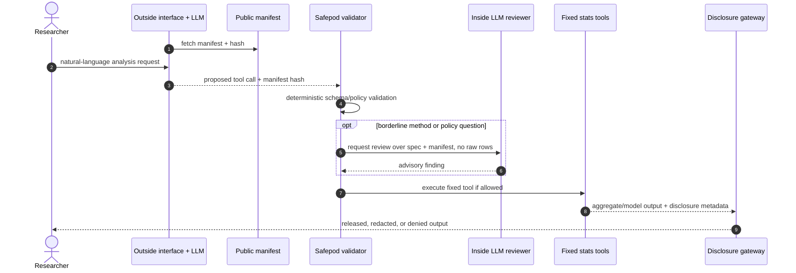

# Tool manifest and two-LLM workflow

What outside AI assistants are told this system can do, and why that public
contract is not authorization: every proposed call is re-validated inside.

The intended production shape has two LLM-facing layers:

- **outside LLM**: user-facing planner, possibly a frontier model, outside the
  safepod;
- **inside LLM**: optional safepod-side reviewer/helper for statistical
  appropriateness and policy interpretation.

Neither LLM is the security boundary. Both are constrained by a signed,
versioned tool manifest and deterministic safepod validation.

## Workflow



## Public manifest

The outside LLM needs to know what is available, but not anything row-level. The
public manifest is safe to show outside the safepod and contains:

- manifest version and SHA-256 hash;
- available tool IDs and request schemas;
- allowlisted datasets, dimensions, and measures;
- coarse constraints such as max filters and max group-by fields;
- release expectations such as minimum cell size and count rounding;
- planned tool classes clearly marked as **not executable**.

The current endpoint is:

```text
GET /api/manifest
```

The manifest currently publishes three executable tools: `aggregate_query`,
`glm`, and `anova`. `aggregate_query` supports fixed count, mean, sum, sum of
squares, and Pearson correlation requests. Correlation uses two validated
measure columns from one dataset and returns only aggregate `value`, `p_value`,
and `n`.

Some fixed tools may use internal analysis variables, such as raw age for
donor-level age/spend correlation. These variables are not public grouping or
output columns. They are accepted only in the specific schema positions the
safepod validator allows.

Stats families still to come, such as `regression` and `survival`, are listed
as planned only (`glm` and `anova` are available). A proposed tool call is
executable only if it appears in `tools[]` with `status: "available"`.

## Inside vetting

The inside LLM can be useful, but only as an adviser. It can review questions
like:

- is a GLM family appropriate for this outcome?
- is the requested contrast interpretable?
- does the formula look like a fishing expedition?
- should this be escalated to human review?
- does the explanation to the researcher make sense?

It must not be allowed to:

- waive deterministic validation;
- lower disclosure thresholds;
- execute code;
- inspect raw rows;
- approve a tool absent from the enforcement manifest;
- return values not produced by a fixed tool and disclosure gateway.

The inside LLM's output should become an audit finding, not an authorization
decision.

## Stats tools

Standard analyses enter as fixed-function tools with explicit schemas, not as
arbitrary code. The first one is live:

| Tool class | Status | Typical use | Key vetting constraints |
|---|---|---|---|
| `glm` | **available (v1, manifest v12)** | gaussian, logistic (binomial), Poisson over categorical terms | fitted from gateway-finalized design cells only (R15/P21); any suppressed cell denies the model (P19); ≤ 3 terms, canonical links, per-dataset response allowlist; releases coefficients + model block + the vetted cell table; no row diagnostics ever (P20) |
| `anova` | **available (v1, manifest v12)** | one-way analysis of variance from vetted group cells | fitted from the same gateway-finalized mean/`sum_sq`/`n` cells the gaussian GLM plans; any suppressed cell denies the table (P19); reproducible from the released cell table |
| `regression` | planned | continuous-predictor linear models (moment cells, L2) | min rows per parameter, bounded covariate count, no residual/fitted-value release |
| `survival` | parked | time-to-event models | extra caution: event counts, censoring patterns, and time granularity can disclose |

The `glm` entry deliberately does **not** follow this table's original "min
events per parameter / no rare levels" sketch: under the cells-first
architecture those output-side heuristics are superseded by the gateway
itself vetting every design cell (see
[verifiable-extensions §5](verifiable-extensions.md)). Non-gaussian models
with continuous predictors — which genuinely need output-side checking — wait
for ACRO.

Every stats tool should define:

- request schema;
- allowed datasets and variables;
- parameter limits;
- minimum cohort and per-level counts;
- model diagnostics that may be released;
- model diagnostics that must never be released;
- disclosure checks for coefficients, contrasts, p-values, CIs, residuals, and
  influence measures;
- audit fields and manifest version.

## Regression outputs are disclosure outputs

Model outputs can leak. A coefficient for a rare category, a separated logistic
model, a very narrow confidence interval over a tiny group, or a suppressed
level implied by a contrast can all disclose information. Treat model summaries
like aggregate tables: they need minimum support, dominance/influence checks,
rounding, suppression, lineage tracking, and sometimes denial.

## Update discipline

The manifest is part of the safepod contract. Do not auto-update it inside a
real safepod. A new tool or changed manifest requires the same process as a code
update: security review, tests, signed/pinned artifact, deployment approval, and
audit trail.
